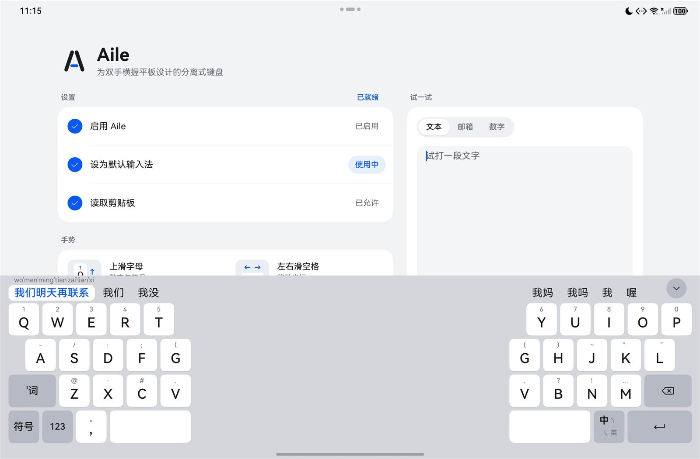
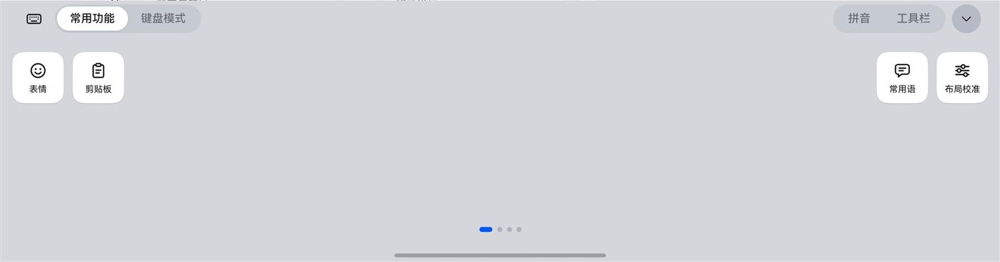
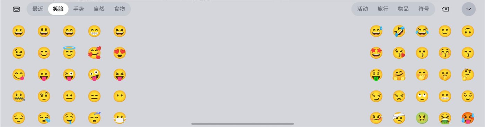
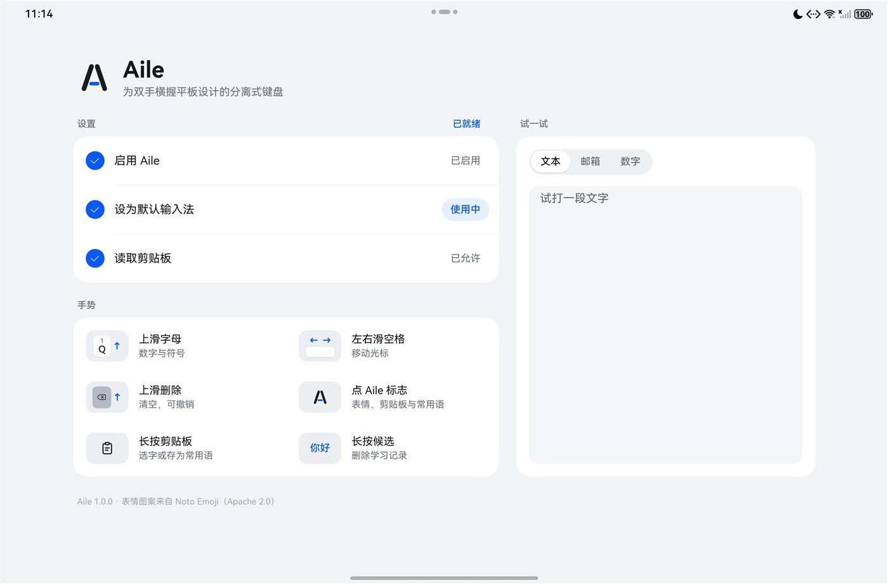
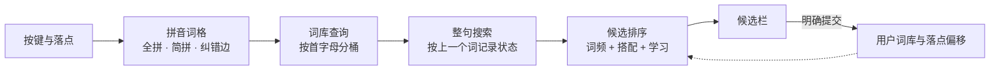

<p align="center">
  
</p>

<h1 align="center">Aile</h1>

<p align="center">
  <b>为双手横握平板设计的分离式 HarmonyOS 输入法</b><br>
  键盘分成左右两半，各自带有一个空格键。
</p>

<p align="center">
  
  
  
  
  
  <a href="https://linux.do"></a>
</p>

<p align="center">
  <a href="#快速上手">快速上手</a> ·
  <a href="#界面一览">界面一览</a> ·
  <a href="#拼音引擎">拼音引擎</a> ·
  <a href="#评测数据">评测数据</a> ·
  <a href="鸿蒙平板输入法开发文档.md">开发文档</a>
</p>

<p align="center">
  
</p>

<p align="center"><sub>输入 womenmingtianzailianxi 时，首选候选为“我们明天再联系”。本页截图均来自模拟器，机型为 MatePad Pro 12。</sub></p>

---

## 为什么做 Aile

横握平板打字时，拇指很难够到屏幕底部正中的空格键。

Aile 把键盘拆成左右两块，并让两块各自带上空格、删除与回车等常用按键。双手握住平板以后，两只拇指都能直接完成打字、确认候选与删除。

在法语里，Aile 的意思是翅膀。图标里的 A 形向两侧分开，对应左右展开的两个键区。悬在中间的短横代表空格键，也就是两只拇指共用的那个位置。

## 功能亮点

- **双空格分离布局**：横屏时，键盘默认拆成左右两块，并在两侧各放一个空格键。中文组词期间，两个空格键都会确认首选候选。
- **整句拼音引擎**：引擎按词频与词间搭配为整句打分，并直接给出“我们明天再联系”这样的整句候选。
- **误触与打错纠正**：引擎会根据手指落点考虑相邻字母，并纠正互换、多打与漏打这三类打错。比如输入 `zhnogguo` 时，首选候选就是“中国”。
- **扩充后的词库**：在 AOSP 词库的基础上，本项目补充了微信、朋友圈、鸿蒙与横屏这类常用词，使词库达到 66271 条。
- **本机学习**：用户明确提交候选以后，引擎才会调高这些词的排序。整句候选需要确认两次，才会学成新词。
- **落点偏移学习**：拇指斜着够向远处的按键时，落点往往偏向固定的一侧。键盘会记下每个字母键的偏移，并据此计算误触代价。
- **可调布局**：在布局校准界面里，用户可以拖动滑块调整键盘高度、键区宽度、边距与空格宽度。
- **表情、剪贴板与常用语**：点按顶部栏的 Aile 标志，就能打开这些面板。分离布局下，面板内容也按左右键区分开排列。
- **完全离线**：应用只申请读取剪贴板这一项权限，没有申请网络权限。

## 界面一览

### 整句与纠错

<p align="center"></p>

输入 `zhnogguo` 时，引擎纠正字母顺序后给出“中国”。右手区在 H 与 B 的左侧各补了一个 G 与 V，让右手食指不必跨过中央间隙。

### 功能面板

<p align="center"></p>

功能面板分为常用功能、键盘模式、拼音与工具栏四页，并把磁贴按左右键区分开摆放。模糊拼音的开关位于拼音页，默认处于关闭状态。

### 表情

<p align="center"></p>

在分离布局下，表情面板也拆成左右两块，并让两块内容一起上下滚动。面板用 Noto Emoji 的图片显示表情，并向输入框写入标准的 Unicode 字符。

### 布局校准

<p align="center"></p>

校准界面浮在两个键区之间，让用户拖动滑块时直接看到按键的变化。对于横屏与竖屏，键盘分别保存一套参数。

### 应用首页

<p align="center"></p>

应用首页实时显示设置进度，并提供手势速查与试打区。启用与设为默认两步各带一个按钮，可以直接跳到系统的输入法设置页。

## 手势速查

| 操作 | 效果 |
|---|---|
| 字母键上滑 | 输入键帽上方的数字或符号 |
| 逗号键上滑 | 输入句号 |
| 左右滑动空格键 | 移动光标，抬起手指后不输入内容 |
| 中文组词时按任一空格 | 确认首选候选 |
| 中文组词时按左下角的 `'词` 键 | 插入音节分隔符 |
| 删除键上滑 | 清空输入框；组词期间只清空拼音 |
| 顶部栏的“撤销清空” | 恢复清空前的全文与光标位置 |
| 点按候选栏右侧的展开按钮 | 打开自由选词界面 |
| 长按候选 | 删除这个词的学习记录 |
| 长按剪贴板卡片 | 选字、存为常用语或删除 |
| 单击或双击 ⇧ | 大写一次，或锁定大写 |

## 拼音引擎

引擎全部用 ArkTS 编写，并直接运行在输入法扩展的进程里。从按键到候选栏，整个流程如下。



<details>
<summary><b>拼音词格</b></summary>

<br>

引擎先把字母串切成一张词格，并用每条边表示一段拼音的一种读法。边分为完整音节、未打完的音节、简拼与分隔符四类，并各自带有对数域的代价。

整串能用完整音节切开时，切进音节内部的简拼边会多扣 3.0 分。因此，引擎会把 `hengping` 切分成 `heng'ping`，并给出“横屏”这个首选。

对于 `sh`、`zh` 这类只有声母的输入，简拼照常生效。每条简拼边扣 2.2 分，并可以使用全部声母以及 a、e、o 作为首字母。

</details>

<details>
<summary><b>误触与打错纠正</b></summary>

<br>

手指落下时，键盘记下落点，并把附近的字母也当作可能的输入。每个候选字母的代价来自两个按键产生该落点的对数似然之差，另加 0.8 的先验。

原文切不开时，引擎会再加入相邻字母互换、多打一个字母与漏打一个字母三种纠正。这三种纠正的代价依次为 5.5、5.5 与 6.0，略高于手指按在邻键正中时的误触代价。

对于末尾没打完的音节，纠正结果必须带有韵母。有了这条限制，`bs`、`zhg` 这类简拼就不会被当成打错。每个词语最多纠正一个音节，以免把正常输入改得面目全非。

</details>

<details>
<summary><b>整句搜索与词间搭配</b></summary>

<br>

整句搜索按“上一个词语”分别记录状态，并在每个位置保留 6 种状态。每段拼音最多保留 3 个最可能的词语，用于组合出整句。

两个相邻词语在自编语料里一起出现过时，引擎会加上 `2.0 × log(1 + 次数)` 的分数。次数超过 60 时，引擎按 60 计算。没有出现过的搭配不加分，也不扣分。

搭配表来自 `tools/lexicon-src/corpus` 下的 1160 句自编语料，共有 5200 组搭配。最好的整句超过三个词语时，得分相差不到 2.5 的次好整句也会列在候选里。

</details>

<details>
<summary><b>词库与加载</b></summary>

<br>

基础词库来自 AOSP PinyinIME，共有 65105 条，并按 Apache-2.0 许可使用。本项目在此之上整理了 1167 条新词，并调高了 1055 条已有词语的词频。合并以后，词库共有 66271 条词语。

构建脚本会用 AOSP 的单字读音逐字核对新词，读音对不上时给出提醒。多音字取了非常用读音时，`--notes` 模式会列出这些词语，供人工复核。

词库文件按首字母预先分桶，并在开头写出每个桶的位置。输入法启动时只读取索引，并在第一次查询某个桶时解析其中的词条。因此，模拟器上的加载耗时由 3403 毫秒降到 75 毫秒。

</details>

<details>
<summary><b>学习与隐私边界</b></summary>

<br>

引擎只在用户明确提交候选时学习，并跳过标点、数字或切换页面引起的自动提交。由引擎拼出的整句第一次确认时先进入待定表，一个月之内再次确认才会学成新词。用户分段选出的词组确认一次，就会学成新词。

键盘还会记录每个字母键的落点偏移，并在同一个按键确认满 20 次以后启用这项偏移。这项偏移只用于计算误触代价，不会改变按键的命中范围。分离布局与常规布局的偏移分开记录，并保存在 `touch_offsets.json` 里。

学习记录只保存在输入法扩展的沙箱里，并可以通过长按候选逐条删除。

</details>

<details>
<summary><b>性能</b></summary>

<br>

连续打字时，引擎会沿用边特征没有变化的词弧。在离线评测里输入 49 个字母的整句时，各起点的搜索次数合计由 1225 次减少到 399 次。

在模拟器上输入同一句话时，每次按键的耗时都在 25 毫秒以内。输入法刚启动后的前几次按键需要解析词库桶，耗时约为 30 到 50 毫秒。

</details>

## 评测数据

引擎调参以 `tools/engine-bench` 的离线评测为依据，并让评测样本与词库、语料保持分开。词语样本共有 400 个常用词，分别按七种方式查询。整句样本共有 298 句日常用语，其中双数行的一半专门留作验证。

**词语：目标词排在首位的比例**

| 查询方式 | 改版前 | 改版后 | 改版后前三 |
|---|---:|---:|---:|
| 全拼 | 99.5% | 99.5% | 100% |
| 简拼 | 53.3% | 52.0% | 87.8% |
| 误触，落在两键交界 | 99.3% | 99.0% | 99.5% |
| 误触，落在邻键正中 | 65.0% | 64.5% | 72.8% |
| 相邻字母互换 | 0% | **70.5%** | 81.0% |
| 多打一个字母 | 0.3% | **68.8%** | 89.8% |
| 漏打一个字母 | 28.8% | **60.7%** | 73.7% |

**整句**

| 指标 | 改版前 | 改版后 |
|---|---:|---:|
| 首位比例 | 68.5% | **81.5%** |
| 前三比例 | 68.5% | **85.2%** |
| 字准确率 | 92.4% | **96.0%** |
| 验证半边的首位比例 | 66.4% | **79.9%** |

由于同一组首字母本身对应多个常用词语，简拼首位比例的上限约为 54%。

运行评测时，脚本会把引擎源码复制成 TypeScript，并用 DevEco 自带的 tsc 编译：

```powershell
powershell -ExecutionPolicy Bypass -File tools\engine-bench\run.ps1
```

对比其他版本时，可以用 `-EngineDir` 指向另一份引擎源码，并用 `-Lexicon` 指向另一份词库。加上 `-NoBigram` 以后，评测会关闭词间搭配。

## 快速上手

### 准备环境

- DevEco Studio，并安装 HarmonyOS 6.0.2（API 22）SDK
- 一台鸿蒙平板，或者一台 Tablet 模拟器
- 在真机上安装时，需要一个用于调试签名的华为账号

### 构建

用 DevEco Studio 打开工程并完成 Sync，然后构建 `entry` 模块即可。如果习惯命令行，也可以调用 DevEco 自带的 Node、ohpm 与 hvigor：

```powershell
$deveco = 'D:\HUAWEI\DevEco Studio'   # 改成本机的安装目录
$node = "$deveco\tools\node\node.exe"
$env:JAVA_HOME = "$deveco\jbr"
$env:DEVECO_SDK_HOME = "$deveco\sdk"

& $node "$deveco\tools\ohpm\bin\pm-cli.js" install
& $node "$deveco\tools\hvigor\bin\hvigorw.js" --mode module `
  -p product=default -p module=entry@default -p buildMode=debug assembleHap --no-daemon
```

构建产物位于 `entry/build/default/outputs/default/`，其中的 `entry-default-unsigned.hap` 可以直接安装到模拟器上。

> [!NOTE]
> 安装到真机时，需要使用签名以后的 `entry-default-signed.hap`。仓库里的 `build-profile.json5` 记录着作者本机的签名路径，并需要在换电脑以后重新配置。
>
> 重新配置时，请在 **File › Project Structure › Signing Configs** 里生成自动签名。签名证书与密钥需要在本机自行生成，并且不会进入版本库。

### 安装与启用

```powershell
$hdc = "$deveco\sdk\default\openharmony\toolchains\hdc.exe"
& $hdc list targets
$target = '换成 list targets 列出的设备标识'
& $hdc -t $target install -r entry\build\default\outputs\default\entry-default-signed.hap
```

1. 打开 Aile 应用，点按“启用 Aile”旁边的按钮，在系统的输入法页面里打开 Aile。
2. 回到应用首页，点按“设为默认输入法”旁边的按钮，把默认输入法换成 Aile。
3. 需要键盘收录复制过的文字时，在首页允许读取剪贴板。
4. 在首页右侧的试打区里点一下，就可以开始输入。

## 项目结构

```text
Aile/
├── AppScope/                      应用级配置与图标
├── entry/src/main/
│   ├── ets/
│   │   ├── engine/                拼音引擎：词格切分、整句搜索、词库、搭配与用户词库
│   │   ├── ime/                   输入法控制：组词状态、提交、面板与剪贴板
│   │   ├── inputmethod/           InputMethodExtensionAbility 入口与键盘页面
│   │   ├── keyboard/              布局计算、触摸路由、误触纠正与落点学习
│   │   │   └── components/        键帽、候选栏、功能面板、表情、剪贴板与布局校准
│   │   ├── pages/                 应用首页：设置进度、手势速查与试打区
│   │   └── storage/               布局参数与用户词库的持久化
│   └── resources/rawfile/
│       ├── lexicon/               基础词库与词间搭配表，由脚本生成
│       └── emoji/                 Noto Emoji 图片
├── tools/
│   ├── build-lexicon.mjs          合并 AOSP 词库与自整理常用词
│   ├── build-bigram.mjs           从自编语料统计词间搭配
│   ├── engine-bench/              引擎离线评测
│   └── lexicon-src/               词库原料：AOSP 原始词库、常用词与语料
├── promo/                         宣传视频与生成脚本
├── docs/images/                   README 截图
└── 鸿蒙平板输入法开发文档.md         开发文档与决策记录
```

## 扩充词库

常用词按主题放在 `tools/lexicon-src/aile-words` 下，并在每行写明一个词语与它的拼音：

```text
@5
微信 wei xin
朋友圈 peng you quan
```

文件里的 `@5` 到 `@1` 表示等级，依次对应 30000、10000、3000、1000 与 300 的词频。对于词库里已有的词语，构建脚本取两者中较大的词频。

另外，`@set N` 可以强制指定之后词语的词频。如果要删除词库里的旧写法，请把这些词语写在 `@remove` 之后。

修改词库或语料以后，请依次运行两个构建脚本：

```powershell
& $node tools\build-lexicon.mjs --notes
& $node tools\build-bigram.mjs
```

`build-bigram.mjs` 会检查语料是否整句包含评测句子，发现重合时会列出这些句子。为了保证评测结果可信，请先改写这些语料，再重新生成搭配表。

> [!IMPORTANT]
> 由于词库索引按 UTF-16 码元记录偏移，词库文件必须保持 LF 换行。在 Windows 上开启 `core.autocrlf` 时，仓库里的 `.gitattributes` 会让这些文件保持 LF 换行。

## 隐私

- 所有输入都只在本机处理，并不经过任何网络请求。
- 日志只记录拼音长度与耗时，不会写入输入的内容。
- 学习数据只保存在输入法扩展的沙箱里，并随应用一起卸载。
- 用户授予读取权限以后，键盘才会收录剪贴板。未授权时，键盘只能通过系统的粘贴控件读取一次。
- 密码框由系统安全键盘接管，不会交给 Aile 处理。

## 已知限制

- 目前，Aile 只提供全拼这一种输入方案。按照开发文档的规划，双拼、词库导入与更多机型适配属于后续版本。
- 简拼的首位比例约为 52%，已经接近同组首字母本身决定的上限。
- 真机上的按键耗时尚待实测，并可以通过 hilog 里的 `compose slow` 日志读取。

## 开发文档

关于完整的设计决策、平台核实记录与验收方法，请阅读 [鸿蒙平板输入法开发文档](鸿蒙平板输入法开发文档.md)。其中，D01 到 D43 的决策表记录了每项功能的取舍原因。

## 友情链接

- [LINUX DO](https://linux.do)：感谢这个社区，让 Aile 有机会第一次公开分享。

## 致谢与许可

- 基础词库来自 [AOSP PinyinIME](https://android.googlesource.com/platform/packages/inputmethods/PinyinIME/)，并按 Apache-2.0 许可使用。许可声明保存在 `tools/lexicon-src/NOTICE-AOSP-PinyinIME.txt` 里，并随原始词库一起提交。
- 表情图片来自 [Noto Emoji](https://github.com/googlefonts/noto-emoji)，并按 Apache-2.0 许可使用。许可文件与图片放在同一个目录里，也就是 `entry/src/main/resources/rawfile/emoji/`。
- 常用词、语料与评测样本均由本项目自行编写，没有引入外部词表。

截至目前，本仓库自身的代码尚未附带开源许可证。
