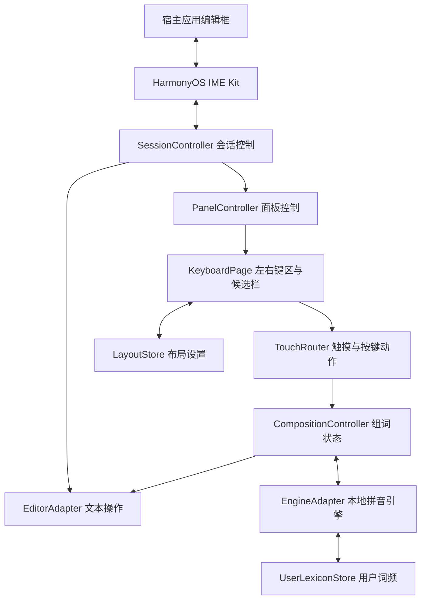

# 鸿蒙平板输入法开发文档

版本：1.0  
编制日期：2026-09-16  
工程目录：`D:\0_Study\0_Stdio\1_ClaudeCode_Work\Z_ShuRuFa`  
目标产品：面向鸿蒙平板双手握持场景的原生输入法  
文档类型：产品需求、技术设计、实施指南与验收规范

本文提供从 Windows 开发环境到真机验收、版本发布的完整实施路径。接口依据华为官方在线文档及本机 HarmonyOS API 22 SDK。参数建议、性能预算和交付周期属于本项目设计目标，测量结果在实施阶段填入验收记录。

当前交付物为开发文档。工程代码、编译产物、签名和设备测试分别在对应里程碑完成。目标平板型号、系统构建号、API 等级、屏幕尺寸及横竖屏握持习惯列入首次设备接入记录。

## 目录

1. 产品目标与范围
2. 已核实事实与技术决策
3. Windows 环境与缺项
4. SDK 版本与兼容策略
5. 工程创建与资源配置
6. 总体架构与模块职责
7. 生命周期与会话管理
8. 系统面板与底部区域验证
9. 平板拇指布局
10. 触摸、手势与无障碍
11. 输入状态机与编辑框交互
12. 中文拼音引擎与词库
13. 数据存储与设置同步
14. 安全模式与权限
15. 核心接口示例
16. 构建、签名与安装
17. 真机和模拟器测试
18. 性能与可靠性
19. 故障定位
20. 发布与版本维护
21. 开发计划与交付标准
22. 首次实施清单
23. 官方资料与本机证据索引
24. 附录：验收记录模板

## 1. 产品目标与范围

### 1.1 使用场景

用户双手握持鸿蒙平板，主要通过左右拇指输入中文和英文。当前主要痛点是底部辅助功能区域占用空间，空格键的实际位置超出舒适触达范围。产品优先优化空格、候选确认、退格和回车这四类高频操作。

核心目标：左右拇指在稳定握持姿势下均可完成空格或首候选确认；键盘宽度、边距、高度及分离距离可以按个人习惯调整。

### 1.2 版本范围

| 版本阶段 | 交付内容 | 验收重点 |
|---|---|---|
| P0 面板验证原型 | 系统输入法注册、英文输入、双空格、退格、回车、面板测量 | 可在目标平板的其他应用中调用，取得真实系统边界 |
| P1 日常输入版本 | 全拼、中文候选、数字符号、中英切换、布局设置、本地保存 | 可完成连续中文写作与聊天 |
| P2 体验完善版本 | 用户词频、简拼、可选模糊音、深浅色、无障碍、物理键盘协同 | 常用任务稳定、误触可控、设置可恢复 |
| P3 扩展版本 | 双拼、词库导入、获批共享设置、更多机型适配 | 扩展功能通过独立验收 |

语音、翻译、云联想、账号同步和 AI 功能进入后续独立需求评审。P1 的输入链路采用本地处理，网络依赖为零。

### 1.3 可验收需求

| 编号 | 需求 | 验收方法 |
|---|---|---|
| R01 | 在系统输入法列表中显示，并可由用户启用 | 安装、启用、切换及重启验证 |
| R02 | 横屏采用左右分离布局，左右各有空格/候选确认键 | 双手握持完成标准短文输入 |
| R03 | 空格位置、左右宽度、边距和整体高度可调 | 调整后即时预览，重启后恢复 |
| R04 | 中文全拼提供候选与连续组词 | 固定测试语料及人工输入验收 |
| R05 | 编辑框动作键跟随发送、搜索、完成、换行语义 | 在对应类型输入框逐项验证 |
| R06 | 横竖屏、分屏和窗口尺寸变化后保持可用布局 | 旋转与窗口切换测试 |
| R07 | 用户通过工具栏访问设置和语言切换 | 验证功能入口与无障碍标签 |
| R08 | 系统辅助区与自有按键保持清晰边界 | 记录 insets、窗口尺寸和触点 |
| R09 | 输入内容在本地完成处理 | 基础模式全功能输入验收 |
| R10 | 输入法切换、焦点变化及进程重建后恢复可输入状态 | 连续切换、故障恢复测试 |

### 1.4 成功标准

由用户在相同平板、屏幕方向、系统版本和文本下分别测试小艺输入法与本项目。每种布局完成至少三轮测试，记录总耗时、空格误触次数、候选确认误触次数和握持调整次数。项目验收以实际触达舒适度、空格操作稳定性和持续输入体验为依据。

## 2. 已核实事实与技术决策

### 2.1 平台事实

| 项目 | 已核实内容 | 工程含义 |
|---|---|---|
| 系统输入法入口 | `InputMethodExtensionAbility`，Stage 模型 | 输入法由系统加载其扩展能力 |
| 面板数量 | 每个输入法应用可创建一个软键盘面板和一个状态栏面板 | 左右分离键盘放在同一个软键盘面板内 |
| 固定面板 | `FLG_FIXED` 由系统在屏幕底部定位 | 通过尺寸和内部布局调整体验 |
| 面板移动 | 固定软键盘调用 `moveTo()` 时实际位置保持原位 | 移动能力用于符合条件的可移动面板 |
| 底部区域 | `getSystemPanelCurrentInsets()` 返回当前屏幕与面板形态下的偏移 | 旋转、模式变化和屏幕变化后重新查询 |
| 功能键外观 | `setSystemPanelButtonColor()` 设置系统面板按钮颜色 | 外观适配单独处理 |
| 热区接口 | `updateRegion()` 接受 1～4 个面板内矩形区域 | 左区、右区、候选栏可组成分离触控区域 |
| 预上屏结束 | `finishTextPreview()` 将现有预上屏文本正式提交 | 候选确认采用单一路径，确保一次提交 |

依据：[华为输入法服务 API](https://developer.huawei.com/consumer/cn/doc/harmonyos-references/js-apis-inputmethodengine)、[输入法实现指南](https://developer.huawei.com/consumer/cn/doc/harmonyos-guides/inputmethod-application-guide)。

### 2.2 底部按键的能力边界

华为官方说明，小艺输入法底部地球键与智慧键的显示由当前产品设计决定；部分特殊机型采用专门适配。第三方输入法实际获得的系统面板区域需要通过目标平板确认。[华为底部按键说明](https://consumer.huawei.com/cn/support/content/zh-cn16014243/)

本项目把“删除系统辅助区”记为待验证能力。已确认的公开接口提供区域查询、面板尺寸配置和功能键颜色设置。按钮隐藏、系统区域接管、中央透明区点击穿透分别设置验证项。

`insets = 0` 表示该接口返回的当前偏移为零。可绘制范围、可触摸范围、系统导航范围和应用避让范围分别测量。

### 2.3 初始架构决策

| 决策编号 | 选择 | 原因 |
|---|---|---|
| D01 | ArkTS + ArkUI + Stage + IME Kit | 与当前本机 SDK 和官方输入法扩展模型一致 |
| D02 | 一个软键盘面板，内部左右两组按键 | 符合面板数量限制，便于统一候选和会话状态 |
| D03 | 第一轮验证使用 API 22 | 本机配套环境完整，包含系统面板查询和颜色接口 |
| D04 | P1 使用基础模式和本地输入链路 | 适配系统安全模型，支持离线使用 |
| D05 | 布局参数和用户词频保存在输入法扩展独立沙箱 | 基础模式下可以读写，数据归属清晰 |
| D06 | 先验证面板触达，再投入完整拼音引擎 | 尽早确认项目最核心的可用空间和交互目标 |
| D07 | SDK 升级通过 DevEco 的配套管理机制完成 | 保持编译、打包、调试工具的版本协同 |
| D08 | 横屏默认分离布局，竖屏默认常规布局，两种形态均可切换 | 双手握持时拇指直达双空格，竖屏保留常规打字习惯 |
| D09 | 纯 ArkTS 拼音引擎，基础词库采用 AOSP PinyinIME 词库（Apache-2.0） | 工程保持单一语言，词库许可清晰，约 6.5 万词带词频 |
| D10 | 自学习由本项目实现，包含词频强化、时间衰减、新词学习和前后词关联 | 学习数据只保存在输入法扩展沙箱，可关闭和清除 |
| D11 | 不编写单元测试，所有调整在模拟器和真机上直接验证 | 实际渲染和触摸环境更能暴露布局、刷新与交互问题 |
| D12 | 产品名称为 Aile，标志为顶部分开的 A 形加悬空短横 | Aile 意为翅膀，对应左右展开的两个键区，短横代表两侧拇指共用的空格 |
| D13 | 顶部栏按钮对齐字母键：标志对齐 Q，快捷入口依次对齐 O 与 I，圆形按钮对齐 P | 分离与常规两种形态下按钮都落在拇指已经熟悉的列位上 |
| D14 | 表情面板使用 Noto Color Emoji 的 72px 图片，输入编辑框的仍是 Unicode 字符；功能图标全部自绘 | Noto 为安卓原生表情，图片按 Apache 2.0 授权，Apple 表情与 SF Symbols 只授权在 Apple 平台使用 |
| D16 | 功能面板保留常用功能、键盘模式、拼音、工具栏四页，词频学习与剪贴板收录固定开启 | 标签与磁贴按左右拇指区分布，磁贴不超过两个时全部放在左手区 |
| D17 | 符号页右下角的中英切换键换成锁定键，表情与剪贴板面板延伸到底部手势横条下方 | 符号页不需要切换语言；可滚动内容按沉浸式要求铺满到底部 |
| D15 | 剪贴板收录依赖用户授予 `ohos.permission.READ_PASTEBOARD`，未授权时使用粘贴控件读取一次 | 该权限为受限开放权限，系统级输入法可以申请，上架前需要在 AppGallery Connect 提交申请 |
| D18 | 删除键上滑越过阈值立即清空，按下时正在输入拼音就只清空拼音；清空后顶部栏提供撤销 | 由于框架没有整段删除的接口，键盘读取光标前后的文字后按长度删除。撤销内容只保存在内存中，输入新内容、切换输入框或收起键盘时立即释放。光标一侧超过两万字时，键盘不执行清空。 |
| D19 | 分离布局下，表情面板、剪贴板面板和表情分类标签都按左右键区分成两部分 | 内容每行先排满左手区，再接着排右手区。左右两块内容共用同一个列表，上下滑动时一起滚动。顶部栏宽度不足以放下两组标签时，分类标签合为一组居中显示。剪贴板卡片最窄 140vp，高度为 60vp。卡片里的文字最多显示两行，超出部分用省略号表示。常规布局下，两个面板仍按整宽排列。 |
| D20 | 功能面板去掉“定制工具栏”磁贴，换成常用语入口 | 参照微信输入法的做法，常用语与剪贴板共用一个面板。在面板顶部，两者通过标签切换。长按一张卡片后，卡片上会出现选字、存为常用语和删除按钮。由于输入法里没有自带的文字编辑框，常用语只能从剪贴板存入。另一种方式是点顶部栏的加号，保存输入框里的文字。常用语最多保存 100 条，每条不超过 5000 字。 |
| D21 | 滑动选字把原文拆成方格，汉字、标点和表情各占一格，连续的英文字母或数字合为一格 | 手指从格子上开始滑动时，起点到手指之间的格子统一切换选中状态。从空白处开始滑动时，界面上下滚动。借助预上屏，选中的文字会实时显示在输入框里。点“输入”以后，键盘结束预上屏。编辑框不支持预上屏时，键盘在点“输入”后直接插入文字。选字界面最多显示前 2000 字，只构建可见的行。 |
| D22 | 键盘内的切换动效统一由 `Motion.ets` 提供，只对透明度、位移、缩放和旋转做动画 | 这几类属性由渲染服务插值，不会触发重新布局。大块内容切换时，键盘先移除旧内容，再让新内容淡入。这样一来，同一时刻只需绘制一份内容。面板打开后，下方按键停止绘制。在面板里滚动时，按键也不会被重绘。面板之间切换时，键盘会在下方垫一层底色，避免按键透出来。按照要求，上滑提示的动效保持原样。由于 `TransitionEffect.OPACITY` 是共享实例，对它调用 `animation` 或 `combine` 会改写所有使用处。因此，转场效果一律用工厂方法新建。调试动效时，可以临时调大 `MOTION_SCALE`，在模拟器上截取动画中途的画面。 |
| D23 | 卡片操作按钮增加“取消”，并把选字方格缩小到 28vp | 点“取消”、点按空白处或滚动列表，都会收起操作按钮。显示按钮时，其余卡片会变淡，提示点按别处会先收起按钮。为了在最窄 140vp 的卡片上并排放下四个按钮，每个按钮的宽度改为 34vp。由于选字只需要看清并划过文字，方格不必做成按键的大小。方格缩小后，一屏可以放下更多文字。 |
| D24 | 横向滑动空格键、字母键或标点键时，键盘移动光标并隐去键帽文字 | 在空格键上，横移 10vp 即进入光标模式。在字母键与标点键上，手指要横移 28vp 以上，同时保持横移为竖移的 1.5 倍以上。这样一来，打字时不容易误触。进入光标模式后，光标随手指每移动 9vp 走一个字。手指移动较快时，步长减为 4.5vp。在光标模式下，抬起手指或按下其他手指都不会输入内容。由于编辑框每次只能移动一个字，键盘会逐个发送移动指令。手指来回移动时，键盘只累计净移动量，不会积压过时的指令。光标移动到行首或行尾后停住，不会越过换行符进入相邻的行。由于自动换行的长段落里没有换行符，键盘会把整段当作一行。按照要求，上滑输入和删除键上滑清空都保持原样。 |
| D25 | 应用首页改为两栏布局，并把设置进度、手势速查和试打区分开摆放 | 设置进度实时读取系统状态，从系统设置返回或切换输入法后自动刷新。启用与设为默认两步都带“去设置”按钮，跳转方式见 D32。每一行右侧的状态文字与可按胶囊占用同一块区域，高度与左右内边距完全相同，三行的文字与右边界因此各自对齐，区别只有底色。分组标题右侧的“已就绪”按行内边距加胶囊内边距右移，与卡片内的状态文字落在同一条线上。窗口窄于 840vp 时，两栏改为上下排列。按照极简要求，文案只保留标题和一句说明。应用窗口铺满全屏后，页面背景会延伸到状态栏和底部手势横条下方。页面按系统栏高度留出上下边距，旋转屏幕时重新读取。按照实测结果，试打区只保留文本、邮箱和数字三种输入框。由于密码框由系统安全键盘接管，页面不再提供密码框。 |
| D26 | 分离布局在 H 左侧再放一个 G，常规布局保持一个 G | 分离以后，G 落在左手区的最右侧，右手食指够不到。第二个 G 向中央间隙伸出半个键，与左手区 A 排向右伸出的半个键左右对称，Y、H、B 等按键的位置保持不变。两个 G 的按键 ID 不同，按下高亮与上滑提示互不影响。中央间隙不足时，右手区按伸出后的宽度一起收缩，伸出的按键不会压到左手区。后来 V 也按同样的办法补进右手区，见 D34。 |
| D27 | 功能面板增加“拼音”一页，其中的模糊拼音开关默认关闭 | 点亮后，z 与 zh、c 与 ch、s 与 sh、n 与 l、f 与 h、r 与 l 可以互换，an 与 ang、en 与 eng、in 与 ing 也可以互换，ian 与 iang、uan 与 uang 随之成立。每互换一处扣 1.1 分，因此打出的读音排在前面，常用程度相差三倍以上的模糊读音才会排到前面。开关保存在输入法扩展的沙箱里。 |
| D28 | 字母键按误触纠错参与切分：记下手指落点，把附近的字母也当作可能的输入 | 代价由两个按键产生该落点的对数似然之差加上 0.8 的先验组成，落点正好在两键交界处时只剩先验。代价不超过 3.2 的字母总是参与切分，手指按在交界附近时才会达到。原文切不开时，或者最后一个音节没打完时，放宽到全部相邻字母，打错最后一个字母因此也能纠正。放宽档另加 2.0 的代价，手指按在按键正中时，原文读得通的写法优先，简拼因此不会被邻键的字顶掉。每个词最多纠正一个音节，纠错得到的词只在比同样长度的原文词更可能时列出，最多两个。最好的整句用到纠错时，原文的最好整句紧随其后。 |
| D29 | 词库索引把 n、r 归入 l，f 归入 h，并记下全部索引键的前缀 | 模糊音的两种读音因此落在同一个桶里，查询时再逐个核对读音。搜索音节组合时，没有任何词以当前前缀开头就不再往下展开。候选栏显示拼音切分时复用同一次查询的整句。在模拟器上实测，21 个字母的整句每次按键耗时 1 至 2 毫秒。 |
| D30 | 简拼边始终参与切分，每条扣 2.2 分，首字母包含全部声母以及 a、e、o | 按原来的做法，只有整串切不开时才启用简拼。sh、ng 这类串本身是音节开头，aq、eq 这类串首字母是韵母，整串都能切开，简拼因此从不启用，时候、那个、安全、而且都打不出来。现在简拼边与完整音节边并存，末尾已有不完整音节时不再重复添加。纠错边不参与“这一段是否已有边”的判断，wsm 这类整串简拼不会被邻键顶掉。 |
| D31 | 引擎调参依据 `tools/engine-bench` 的离线评测，不靠单条输入的观感 | 词语样本固定在 `words.txt` 里，取自改版前词库最常用的 400 个多音节词。由于样本不再随词库生成，词库扩充以后的数字可以直接比较。每个词语分别用全拼、简拼、误触-交界、误触-正中、相邻字母互换、多打一个字母与漏打一个字母七种方式查询，统计目标词排在首位与前三位的比例。整句样本收在 `sentences.txt` 里，共有 298 句日常用语。这些句子与二元语料分开编写，并由 `build-bigram.mjs` 检查两者是否重合。调参时只参考单数行的一半句子，汇报时引用双数行的另一半。改版以后，四项原有指标依次为全拼 99.5%/100%、简拼 52.0%/87.8%、误触-交界 99.0%/99.5%、误触-正中 64.5%/72.8%。三类打错依次为 70.5%/81.0%、68.8%/89.8%、60.7%/73.7%，改版前依次为 0%/20.8%、0.3%/41.8%、28.8%/47.4%。在整句样本上，首位比例、字准确率与验证半边的首位比例依次由 68.5%、92.4%、66.4% 提高到 81.5%、96.0%、79.9%。这一版还修正了评测里的一处偏差，邻键改为按实际按下的那个按键计算。由于 G 在左右键区各有一个，原来的算法把右手 G 的邻键当成了左手 G 的邻键。修正以后，误触-交界的首位比例在同一引擎上由 92.8% 变为 99.3%。由于同一组首字母本身对应多个常用词语，简拼首位比例的上限约为 54%。关于设备上的耗时，详见 D43。 |
| D32 | 首页的“启用 Aile”与“设为默认输入法”一步跳到 设置 › 系统 › 输入法，按 uri `set_input` 显式启动设置应用 | 设置应用的 MainAbility 按 want 的 uri 选择要打开的页面，uri 与内部页面名同名，输入法页面叫 `set_input`。这个名字不在能力声明的 uri 列表里，隐式启动匹配不到，只能写出包名 `com.huawei.hmos.settings` 与 `com.huawei.hmos.settings.MainAbility` 显式启动，该 Ability 已导出且不需要权限。名字的来源是设置应用自己的日志：在设置里手动点开输入法，hilog 打出 `navigate to set_input` 与 `import file set_input ../../Setting/System/InputPage`，页面名与 uri 是同一套。打不开时依次退到 `inputMethod.getSystemInputMethodConfigAbility()`，以及 action 为 `ohos.want.action.viewData`、uri 为 `system_and_updates` 的隐式 Want，后者落在上一层的“系统”页。配置界面返回的包名属于某个已安装输入法时按不可用处理，模拟器上它指向预置输入法自己的设置应用。全部走不通时页面弹一条提示，写明 设置 › 系统 › 输入法。原来调用的 `showOptionalInputMethods()` 在模拟器上只画出一块未套用主题的选择框，一并去掉。设为默认这一步完成以后，右侧保留一枚可以按的胶囊，按下同样打开输入法页面，随时换回别的输入法。 |
| D33 | 自由选词界面改为平铺文字加行分隔线，最下排控件落在浅色轨道上 | 候选不再画成白色键帽，按下时才出现圆角底色，第一候选用强调色。排布的最小单位由整个键宽改为四分之一键宽，词条宽度因此贴近文字本身，同一行能多放词。每个键区的行与行之间画一条分隔线，最后一行不画。全部、词语、单字合成一条分段控件，选中项是实心强调色胶囊。翻页键带方向箭头，页码落在两个翻页键中间，常规布局把空格键位分成翻页、页码、翻页三段。返回与删除各占一块轨道。长按候选删除学习记录，与候选栏的做法一致。 |
| D34 | 分离布局右手区在 B 左侧补一个 V，最下排跟着向中间伸出半个键 | 原来只有 G 一个键伸出，右手区左边界单独凸出一块。补上 V 以后 G 与 V 同列，最下排的 lead 改为 -0.5，空格的左边与这两个键连成一条直线，回车键相应加宽 0.5 补齐右边界。伸出的宽度写成 `RIGHT_LETTER_OVERHANG`，`splitBottomRight` 按参数接收。符号页传入 0，让最下排仍与键区左边界齐平。数字页的最下排后来另行调整，见 D36。自由选词界面的键区左边界改取该键区最左侧的单元格，候选网格因此覆盖伸出的那半个键，与最下排的翻页轨道对齐，右手区每行多放一列。 |
| D35 | 候选栏的第一候选坐在一块圆角底色上，其余候选保持平铺 | 华为候选栏的做法是第一候选带一块键帽色的圆角底，文字用强调色，这里照着做。浅色下底色是白色，与键帽同色；深色下键帽色 `#666666` 会把蓝字压到 1.5 的对比度，改用深蓝 `#1A2A4D`，对比度回到 3.7，因此单独加了 `kb_candidate_pill` 一组颜色。候选两组的起点与宽度各让出半个键间距，第一候选的底色左边与 Q 键帽左边落在同一条线上，与表情、剪贴板面板的内容区算法一致。最上一行拼音不动。 |
| D36 | 分离布局数字页把 0 与小数点移到最下排，空格竖着占住右侧一列的上面两格 | 原来的右侧一列里，上面两格是小数点与 0。最下排的左边，原来放着一枚横向的空格。两处按键对调以后，小数点与 0 依次落在 7 和 8 的正下方。中英切换与回车依次落在 9 与删除键的正下方，和上面几行共用同一套列宽。右侧一列取 1.5 个键宽，与字母页的删除键和回车相同。三列数字平分剩下的 3.5 个键宽，每列约 1.17。`KeyDef` 新增可选字段 `rowSpan`，表示向下跨越的行数。布局引擎排到下面几行时，会跳过跨行按键占住的区间。跨行按键的单元格按行数合并高度，在命中与按下时覆盖整块区域。空格宽度的设置只作用于最下排横放的空格，对竖着跨行的空格不起作用。竖着的空格沿用所在一列的宽度，输入效果与横放的空格相同。常规布局的数字页保持原样，没有跟着调整。 |
| D37 | 基础词库补充本项目整理的常用词，读音逐字核对 | 由于 AOSP 词库的数据年代较早，微信、朋友圈、点赞、表情包、鸿蒙与横屏这些常用词语都查不到。本项目在 `tools/lexicon-src/aile-words` 下按主题整理了十八个文件，并在每一行写明词语与拼音。文件里的 @5 到 @1 表示等级，依次对应 30000、10000、3000、1000、300 的词频。对于词库里已有的词语，构建脚本取两者中较大的词频，比如二维码由 128 调高到 10000。构建脚本用 AOSP 的单字词条核对每个汉字的读音，读音对不上时给出提醒。多音字取了非常用读音时，构建脚本会在 `--notes` 模式下列出这些词语，例如银行、重启与出差。整理新词时只收录本项目自己编写的内容，没有引入外部词表。这一版新增 1167 条，调高 1055 条，并删除了“显着”这一旧写法。至此，词库总数由 65105 条增加到 66271 条。 |
| D38 | 整句加入词间搭配，搜索时按上一个词语记录状态 | 由于原来的整句仅累加每个词语自身的词频，“在”与“再”这类同音词经常被选错。为此，本项目在 `tools/lexicon-src/corpus` 下自行编写了 1160 句日常语料。`build-bigram.mjs` 用词库给语料切词，再统计相邻两个词语一起出现的次数。统计结果共有 5200 组搭配，保存在 `bigram.txt` 里。对于语料里出现过的搭配，引擎会加上 2.0 × log(1 + 次数) 的分数。次数超过 60 时，引擎按 60 计算。没有出现过的搭配不加分，也不扣分。在调参半边上，权重取 2.0 到 3.0 时相差一个句子。由于权重继续提高以后简拼首位比例开始下降，这里取偏保守的 2.0。整句搜索改为按“上一个词语”分别记录得分，每个位置保留 6 种状态，每段拼音保留 3 个最可能的词语。最好的整句超过三个词语时，得分相差不到 2.5 的次好整句会作为第二个候选列出。没有搭配模型时，搜索结果与原来的动态规划相同。 |
| D39 | 整串能用完整音节切开时，切进音节内部的简拼边多扣 3.0 分 | 输入 hengping 时，原来的引擎把它切分成 hen'g'ping，并给出“很公平”。这条路径把 g 当作“公平”里 gong 的简拼，总分为 −17.7。按全拼切分出的“横平”得分为 −19.9，与简拼路径相差 2.2 分。现在引擎会先找出完整音节切分的全部边界，并给起点或终点不在边界上的简拼边多扣 3.0 分。由于 sh、zh 这类输入只有声母，没有完整音节，简拼对它们照常生效。现在输入 hengping 时，引擎会切分成 heng'ping，并把补进词库的“横屏”列为首选。 |
| D40 | 原文切不开时，加入相邻字母互换、多打一个字母与漏打一个字母三种纠正 | 由于原来的纠错仅处理按到邻键的情形，输入 zhnogguo 时的首选为“只能哦各国”。现在原文切不开时，词格会加入三类纠正边，并且限制每个音节最多纠正一处。漏打一个字母时，引擎查找预先算好的对照表，并且不考虑首字母漏打。对于末尾没打完的音节，纠正以后只要是某个音节的开头即可。由于这种写法必须已经带有韵母，bs、zhg 这类简拼不会被当成打错。由于触屏上按到邻键远比这三类打错常见，这三类纠正的代价定得略高一些。互换、多打与漏打的代价依次为 5.5、5.5 与 6.0，接近手指按在邻键正中时的误触代价。改版以后，这三类打错的首位比例依次为 70.5%、68.8% 与 60.7%。 |
| D41 | 自动提交不参与学习，整句确认两次才学成新词 | 组词途中输入标点、数字或切换页面时，键盘会自动提交首选候选。按照 12.4 节的约定，这种不算用户确认的提交不参与词频与按键偏移的学习。整句候选由引擎拼出，第一次确认时先记入待定表，一个月之内再确认一次才学成新词。用户分段选出的词组由用户自己拼成，确认一次就学成新词。待定表保存在用户词库文件的 `pending` 一项里，最多保留 3000 条。旧文件没有这一项时，引擎按空表读取，并且沿用原来的文件版本。在模拟器上，逗号自动提交以后学习记录保持不变。用空格确认一次以后，待定表增加一条。再确认一次以后，这条整句转入用户词库。 |
| D42 | 学习每个字母键的落点偏移，纠错时按偏移后的中心计算邻键 | 拇指斜着够向远处的按键时，落点往往偏向固定的一侧。用户明确提交候选以后，键盘会逐个比对打出的字母与提交的拼音，并只记录两者一致的那些字母的落点。键盘以单元格宽高为单位记录落点，样本较少时取算术平均，样本较多以后按 0.03 的权重滑动更新。同一个按键确认满 20 次以后，偏移量才参与纠错，并限制在 0.3 个单元格以内。偏移量用于计算邻键的代价，让偏向固定一侧的落点不再被当成误触。为了保持原有的打字手感，按下哪个按键由原来的单元格决定。分离布局与常规布局的偏移分开记录，并保存在 `touch_offsets.json` 里。清除学习数据时，这份记录也会一并清除。在模拟器上用空格确认一次输入以后，记录偏移的按键由 15 个增加到 18 个。 |
| D43 | 词库文件改为预先分桶的格式，连续打字时沿用没有变化的词弧 | 在模拟器上实测时，原来的词库加载耗时 3403 毫秒。加载完成之前，键盘只能输入英文。现在构建脚本会预先按索引键给词条分桶，并在文件开头写出每个桶的位置。加载时，引擎只读取一万多行索引，并在第一次查询某个桶时才解析其中的词条。因此，模拟器上的加载耗时降到 75 毫秒。索引同时列出全部键的前缀，让前缀剪枝直接查询同一张表。连续打字时，每输入一个字母，通常只有靠近末尾的几个位置会多出或少掉音节边。引擎会记下每个起点上次读过的位置范围，并在这些位置的边特征串都没有变化时沿用上次的词弧。上文或学习记录变化时，缓存整体作废。在离线评测里输入 49 个字母的整句时，各起点的搜索次数合计由 1225 次减少到 399 次。用户词库给每条词弧加分时，改为直接按词条对象查找记录，不再拼接身份字符串。在模拟器上输入同一个 49 个字母的整句时，每次按键的耗时都在 25 毫秒以内。输入法刚启动后的前几次按键需要解析词库桶，耗时约 30 到 50 毫秒。为了遵守日志不写输入内容的约定，慢按键日志改为只记录拼音长度。平板接上电脑以后，可以读取同一条日志确认真机上的耗时。 |

## 3. Windows 环境与缺项

### 3.1 本机核验结果

以下硬件和工具信息来自 2026-09-15 的只读环境检查；2026-09-16 再次检查了本机 API 22 元数据与关键声明。空闲磁盘和设备连接属于随时间变化的状态。

| 项目 | 检测值 | 当前结论 |
|---|---|---|
| Windows | Windows 11 家庭版 64 位，Build 26200 | 满足 IDE 系统条件 |
| CPU | Ryzen AI 9 H 365，10 核 20 线程 | 可用于本项目开发 |
| 内存 | 23.8GB 可识别物理内存 | 超过官网 16GB 指标 |
| 屏幕 | 2880×1800 | 满足 IDE 分辨率条件 |
| 磁盘 | C 盘空闲 111.5GB；D 盘空闲 244.3GB | 可容纳工程、SDK 和模拟器镜像 |
| 硬件虚拟化 | Firmware virtualization 与 SLAT 均开启 | 模拟器硬件基础具备 |
| PowerShell | 7.6.6 | 开发命令统一通过 PowerShell 7 执行 |
| DevEco Studio | 6.0.2.660 | 已安装 |
| HarmonyOS SDK | 6.0.2.130 Release，API 22 | 已安装 |
| 内置 Node.js | 18.20.1 | 可执行 |
| 内置 ohpm | 6.0.1 | 可执行 |
| 内置 Hvigor | 6.22.7 | 可执行 |
| 内置 JBR | OpenJDK 21.0.8 | 可执行 |
| HDC | 3.2.0c | 可执行 |
| Git | 2.55.0 | 已安装 |
| Native 工具链 | clang++、CMake、Ninja | 安装目录中存在 |
| ohpm 仓库 | 官方仓库返回 PONG | 检查时访问成功 |

华为当前 Windows 配置要求为 Windows 10/11 64 位、16GB 以上内存、100GB 以上硬盘、1280×800 以上分辨率。[DevEco Studio 官方页面](https://developer.huawei.com/consumer/cn/deveco-studio/)

### 3.2 环境完成度

| 状态 | 项目 | 下一步 |
|---|---|---|
| 已具备 | IDE、SDK、IME Kit、构建工具、调试工具 | 创建工程后执行完整编译 |
| 待创建 | 当前目录中的 HarmonyOS 工程 | 通过 DevEco 的 ArkTS 模板创建 |
| 待确认 | 目标平板型号、ROM、API 等级 | 首次连接时记录 |
| 待接入 | HDC 调试设备 | 检查记录为 `[Empty]`，连接后复核 |
| 待配置 | 本工程调试签名 | 登录开发者账号并配置自动签名 |
| 待验证 | 华为开发者账号状态 | 在 DevEco 与开发者管理页面确认 |
| 可选补充 | Tablet 模拟器 | 标准目录中尚未发现已部署实例，首次使用时创建 |
| 待验证 | 模拟器虚拟化软件环境 | 启动模拟器后依据诊断结果处理 |

已有工具的版本查询通过。完整工程编译、HAP 签名、安装和启动验证进入 P0。

### 3.3 工具路径管理

本机 IDE 位置是 `D:\HUAWEI\DevEco Studio`。版本信息读取 `product-info.json`；SDK 信息读取 `sdk\default\sdk-pkg.json`。后续脚本从当前 IDE 根目录和配套清单解析工具位置。

系统 PATH 中的 Node.js 为 24.14.1，Java 为 JDK 17。命令行构建需使用本次选定 DevEco 的配套 Node 和 JBR。直接调用 `.bat` 包装器时，其内部可能按 PATH 解析 Node；仅提供包装器绝对路径仍需检查 Node 的实际来源。

项目锁文件记录依赖版本。IDE 路径与签名材料存放在机器本地配置。工具升级后重新执行环境检查、编译和设备验证。

### 3.4 环境诊断入口

通过 DevEco 欢迎页的 Diagnose，或工程窗口的 `Help → Diagnostic Tools → Diagnose Development Environment` 检查硬件、网络和工具配置。代理沿用既有环境，包仓访问问题按诊断结果逐项处理。[华为环境配置文档](https://developer.huawei.com/consumer/cn/doc/HarmonyOS-Guides/ide-environment-config)

## 4. SDK 版本与兼容策略

### 4.1 开发版本

第一轮使用本机 HarmonyOS 6.0.2 / API 22 Release SDK 完成面板原型。获得目标平板信息后，确定工程最低兼容版本。

| 设备情况 | 工程策略 |
|---|---|
| 目标平板 API 22 及以上 | 原型可直接使用 API 22 能力 |
| 目标平板 API 21 | 保留 insets 查询；颜色设置走版本保护 |
| 目标平板 API 12～20 | 基础输入能力按对应 API 验证，面板边界采用实际窗口测量 |
| 更早系统或其他运行环境 | 单独建立兼容性评估记录 |

`compatibleSdkVersion` 表示安装下限，`targetSdkVersion` 影响目标系统行为适配，编译 SDK 由所选配套工具确定。三者分别记录。项目 API 22 原型通过后，再决定是否降低安装下限。[华为构建配置说明](https://developer.huawei.com/consumer/cn/doc/harmonyos-guides-V5/ide-hvigor-build-profile-V5)

### 4.2 关键能力版本表

| 能力 | API 起始版本 | 设计用途 |
|---|---:|---|
| `InputMethodExtensionAbility` | 9 | 输入法服务入口 |
| `InputClient` | 9 | 文本编辑 |
| `createPanel()` | 10 | 创建软键盘面板 |
| `getSecurityMode()` | 11 | 获取输入法安全模式 |
| `setPreviewText()` / `finishTextPreview()` | 12 | 预上屏与提交 |
| `getDisplayId()` | 15 | 获取键盘实际所在屏幕 |
| `updateRegion()` | 15 | 分离区域触摸验证 |
| `getSystemPanelCurrentInsets()` | 21 | 系统面板偏移查询 |
| `setSystemPanelButtonColor()` | 22 | 系统功能键颜色适配 |

API 起始标记表示接口版本；设备类型和商业系统版本仍按文档适用范围核对。当前在线文档对 Phone、Tablet 的基础能力列有 API 12 起的设备支持信息。[输入法服务 API](https://developer.huawei.com/consumer/cn/doc/harmonyos-references/js-apis-inputmethodengine)

### 4.3 新版本适配

官网当前同时维护 6.0.2 与 26.0.0 开发工具系列。环境升级以目标设备、实际使用的新接口和回归结果为依据。升级前记录现有 SDK 清单，升级后验证编译、签名、HDC 和面板行为。[华为工具发布](https://developer.huawei.com/consumer/cn/information/tools)

## 5. 工程创建与资源配置

### 5.1 创建步骤

1. 在 DevEco Studio 创建 ArkTS / Stage 应用工程，选择带 UIAbility 的基础空工程模板。
2. 项目根目录使用当前工作目录；入口模块命名为 `entry`。
3. 设备类型加入 `tablet`；需要手机回归时再加入 `phone`。
4. 选择配套 Release SDK，按第 4 节设置兼容下限。
5. 项目临时名称使用 `ThumbIME`；最终显示名称和包名在签名前确认。
6. 运行模板工程，验证资源编译、构建和页面加载。
7. 增加输入法扩展、键盘页面和子类型资源。
8. 安装到测试设备，在系统设置中启用输入法。

示例包名 `com.example.thumbime` 用于文档讲解，正式发布时替换为确认后的唯一包名。

### 5.2 建议目录

```text
Z_ShuRuFa/
├─ AppScope/
│  ├─ app.json5
│  └─ resources/
├─ entry/
│  ├─ build-profile.json5
│  ├─ hvigorfile.ts
│  ├─ oh-package.json5
│  └─ src/
│     ├─ main/
│     │  ├─ module.json5
│     │  ├─ ets/
│     │  │  ├─ entryability/EntryAbility.ets
│     │  │  ├─ pages/WelcomePage.ets
│     │  │  ├─ inputmethod/InputMethodService.ets
│     │  │  ├─ inputmethod/pages/KeyboardPage.ets
│     │  │  ├─ ime/ImeController.ets
│     │  │  ├─ ime/ImeState.ets
│     │  │  ├─ ime/PanelController.ets
│     │  │  ├─ ime/EditorAdapter.ets
│     │  │  ├─ ime/CompositionController.ets
│     │  │  ├─ ime/EngineLoader.ets
│     │  │  ├─ ime/Log.ets
│     │  │  ├─ keyboard/KeyDefinitions.ets
│     │  │  ├─ keyboard/Layouts.ets
│     │  │  ├─ keyboard/LayoutProfile.ets
│     │  │  ├─ keyboard/LayoutEngine.ets
│     │  │  ├─ keyboard/TouchRouter.ets
│     │  │  ├─ keyboard/components/
│     │  │  ├─ engine/EngineTypes.ets
│     │  │  ├─ engine/PinyinSyllables.ets
│     │  │  ├─ engine/PinyinSegmenter.ets
│     │  │  ├─ engine/Lexicon.ets
│     │  │  ├─ engine/PinyinEngine.ets
│     │  │  ├─ engine/UserLexicon.ets
│     │  │  ├─ storage/LayoutStore.ets
│     │  │  └─ storage/UserLexiconStore.ets
│     │  ├─ resources/base/profile/
│     │  │  ├─ main_pages.json
│     │  │  └─ input_method_config.json
│     │  ├─ resources/base/element/
│     │  ├─ resources/dark/element/
│     │  ├─ resources/base/media/
│     │  ├─ resources/dark/media/
│     │  ├─ resources/rawfile/emoji/
│     │  └─ resources/rawfile/lexicon/
├─ tools/
│  ├─ build-lexicon.mjs
│  └─ lexicon-src/
├─ hvigor/hvigor-config.json5
├─ hvigorfile.ts
├─ build-profile.json5
├─ oh-package.json5
├─ oh-package-lock.json5
└─ 鸿蒙平板输入法开发文档.md
```

`ime` 目录承载会话、面板、编辑提交与组词状态，`keyboard` 目录承载布局模型、几何计算与触摸路由，`engine` 目录承载拼音引擎与自学习。键盘左上角的 Aile 标志使用 `resources/base/media/aile_mark.svg`，深色模式由 `resources/dark/media` 中的同名文件替换。

基础词库由 `tools/build-lexicon.mjs` 从 `tools/lexicon-src/` 中的 AOSP 原始词库生成。转换结果写入 `rawfile/lexicon/base_lexicon.txt`，许可证文件随词库一同放置。

### 5.3 输入法扩展注册

以下为 `module.json5` 中 `module` 对象的配置片段；模板中已有的 UIAbility、资源和设备信息继续保留。

```json5
"extensionAbilities": [
  {
    "name": "InputMethodService",
    "srcEntry": "./ets/inputmethod/InputMethodService.ets",
    "label": "$string:ime_name",
    "description": "$string:ime_description",
    "type": "inputMethod",
    "exported": true,
    "metadata": [
      {
        "name": "ohos.extension.input_method",
        "resource": "$profile:input_method_config"
      }
    ]
  }
]
```

`deviceTypes` 至少包含 `tablet`。资源中提供 `ime_name`、`ime_description`、子类型名称和键盘图标。所有资源引用逐项通过构建检查。[官方输入法注册步骤](https://developer.huawei.com/consumer/cn/doc/harmonyos-guides/inputmethod-application-guide)

### 5.4 子类型配置

`input_method_config.json` 使用如下结构，中文与英文共用一个输入法扩展。

```json
{
  "subtypes": [
    {
      "id": "zh_pinyin",
      "label": "$string:ime_chinese",
      "icon": "$media:ime_icon",
      "locale": "zh-CN",
      "mode": "lower"
    },
    {
      "id": "en_qwerty",
      "label": "$string:ime_english",
      "icon": "$media:ime_icon",
      "locale": "en-US",
      "mode": "lower"
    }
  ]
}
```

`setSubtype` 事件负责切换对应引擎状态和键盘语言。布局形态属于本输入法设置，横屏分离和竖屏普通布局可以沿用同一语言子类型。[官方子类型指南](https://developer.huawei.com/consumer/cn/doc/harmonyos-guides/input-method-subtype-guide)

### 5.5 页面配置

```json
{
  "src": [
    "pages/WelcomePage",
    "inputmethod/pages/KeyboardPage"
  ]
}
```

键盘通过 `panel.setUiContent('inputmethod/pages/KeyboardPage')` 加载。路径大小写与页面清单一致。

## 6. 总体架构与模块职责



| 模块 | 职责 | 主要输入 | 主要输出 |
|---|---|---|---|
| InputMethodService | 扩展生命周期入口 | 系统创建与销毁 | 控制器初始化和清理 |
| SessionController | 管理当前编辑会话及异步任务有效性 | inputStart、inputStop、属性变化 | sessionId、可输入状态 |
| PanelController | 面板创建、尺寸、模式和边界查询 | 屏幕与布局状态 | 实际面板尺寸、insets |
| EditorAdapter | 封装插入、删除、预上屏和动作键 | 有序文本操作 | 成功、失败或失效状态 |
| LayoutEngine | 计算键帽和触摸矩形 | 内容尺寸、方向、个人设置 | 每个键区的几何信息 |
| TouchRouter | 解析点按、长按、滑动和多指事件 | pointerId、坐标、时间 | KeyAction |
| CompositionController | 协调拼音串、候选、确认和撤销 | KeyAction、引擎结果 | UI 状态与提交请求 |
| EngineAdapter | 隔离具体拼音算法和底层实现 | 拼音操作、候选选择 | 候选快照与待提交文本 |
| LayoutStore | 保存个人布局 | 布局设置 | 经校验的布局档案 |
| UserLexiconStore | 保存明确确认后的词频 | 成功提交的词条事件 | 个性化排序权重 |
| ProbeModel | 记录几何和性能数据 | 窗口测量、耗时 | 去标识诊断记录 |

键盘页面使用当前面板的 `LocalStorage` 或明确的进程内状态对象。输入客户端由 `inputStart` 提供，跨会话访问由 SessionController 管理。主 UIAbility 与输入法扩展的数据连接按第 13 节设计。

## 7. 生命周期与会话管理

### 7.1 扩展生命周期

`onCreate` 中初始化控制器、注册事件、查询安全模式并启动面板创建。异步创建通过共享 Promise 和 generation 标记管理。`onDestroy` 中注销同一回调引用、清理计时器、使异步请求失效并销毁面板。

`inputStart` 建立当前 `InputClient` 与 `KeyboardController` 的有效引用。`inputStop` 终止本次编辑会话、停止重复删除、清空输入状态并释放客户端引用。服务级资源的保留或释放集中在控制器中，释放后再次启动需走可重复初始化路径。

| 事件 | 状态更新 | 资源操作 |
|---|---|---|
| onCreate | ServiceReady / PanelCreating | 注册事件、创建面板、打开本地配置 |
| inputStart | 新 sessionId，读取编辑属性 | 等待面板就绪，建立客户端引用 |
| panel show | 面板可见 | 更新实际尺寸、insets 和布局 |
| inputStop | sessionId 失效 | 清空候选、释放客户端、停止任务 |
| panel hide | 面板隐藏 | 停止动画和长按任务，按会话规则处理组词 |
| setSubtype | 语言子类型变化 | 结束当前组词事务，再切换引擎 |
| securityModeChange | 能力集合变化 | 重算功能可用性，清理受影响资源 |
| onDestroy | Destroyed | 注销监听、销毁面板、关闭资源 |

生命周期依据：[InputMethodExtensionAbility 指南](https://developer.huawei.com/consumer/cn/doc/harmonyos-guides/inputmethod-application-guide)。表内状态名称属于本项目实现约定。

### 7.2 异步有效性

每个事件记录 `sessionId`、`compositionRevision` 和 `layoutRevision`。客户端写入和引擎结果应用前比较版本。焦点切换后，旧请求的处理结果直接丢弃；新会话从空组词状态开始。

插入、删除、候选提交按用户动作顺序串行执行。任何一次操作返回 `false` 或抛出异常时，保留可恢复的本地组词快照，并提示用户重新确认。新会话的客户端仅处理新会话产生的动作。

### 7.3 事件与资源所有权

事件注册时保存回调引用，注销时使用相同引用。PanelController 单独持有面板创建 Promise；并发初始化复用该 Promise。销毁发生在创建完成之前时，创建回调检查 generation，随后执行对应资源清理。

输入框获焦时间早于面板就绪时，先保存本次会话信息，待面板初始化完成后再呈现。用户此时已经切换编辑框的情况通过 sessionId 校验处理。

## 8. 系统面板与底部区域验证

### 8.1 原型测量内容

P0 仅加载测试字母、双空格、退格和动作键，诊断页显示以下几何信息：

- 键盘实际所在屏幕 ID。
- 屏幕宽高、方向和密度。
- 请求的面板宽高及实际内容宽高。
- 当前固定/悬浮模式。
- `left`、`right`、`bottom` 偏移，单位 px。
- 左右键区、空格和候选栏的面板内矩形。
- 系统辅助按钮所在区域的截图标记。
- 自有页面接收到的触点坐标及 pointerId，仅使用人工测试动作。

### 8.2 单位与坐标

面板 API 和 `SystemPanelInsets` 以 px 表示几何数据；ArkUI 常用布局尺寸使用 vp。布局层统一使用 vp，调用窗口 API 时按面板 UIContext 对应的像素转换能力转换为整数 px。

约定三套坐标：屏幕坐标、面板窗口坐标、组件局部坐标。诊断字段明确写出坐标系。`updateRegion()` 的矩形相对于输入法面板左上角。

根组件实际布局尺寸是按键排布的基准。系统偏移记录为外部边界信息；当系统已经把该区域放在自有内容窗口之外时，内部 padding 保持原布局值。这样可避免重复预留底部空间。

### 8.3 面板策略

固定模式作为默认形态；布局调整通过面板高度及内容内部参数实现。调用 `resize()` 时宽度在屏幕宽度范围内，高度在该接口规定的屏幕高度 70% 范围内。调用其他矩形接口时使用其专门的限制条件。

悬浮模式作为独立验证项。左右键区仍由同一个软键盘面板承载。透明区域的视觉效果、点击接收和宿主应用避让效果分别验收。

通过 `panel.getDisplayId()` 获取面板实际所在屏幕，再查询当前 insets。横竖屏切换、面板形态改变、分屏尺寸改变及屏幕迁移后重新测量。[输入法服务 API](https://developer.huawei.com/consumer/cn/doc/harmonyos-references/js-apis-inputmethodengine)

### 8.4 热区验证

P0 先使用完整面板触摸区域。P2 可以评估 `updateRegion()`：最多四块区域分别用于左键区、右键区、候选栏和工具栏。区域更新属于请求提交，实际生效通过触点测试确认。

透明间隙的测试包含：点击间隙是否影响宿主、拖动是否误操作宿主、横竖屏后区域是否同步。通过这些测试后再向用户开放可选设置。

### 8.5 验证结果与实施选择

| 实测结果 | 实施选择 |
|---|---|
| 底部系统区域保留 | 双空格贴近自有内容区下沿，调整键区高度与边距 |
| 左右有额外系统区域 | 依据实际内容尺寸重新计算左右键区 |
| 固定模式触达合适 | 保持固定模式作为默认 |
| 悬浮模式改善触达且系统交互正常 | 作为可选模式发布 |
| 中间触控区域配置验证通过 | 开放中间间隙行为设置 |
| 所有受支持模式均影响用户空格触达 | 调整产品方案并记录平台约束，暂缓完整词库投入 |

## 9. 平板拇指布局

### 9.1 默认布局

```text
分离布局（横屏默认）
候选词栏：组词时显示拼音与候选，空闲时显示 [分离布局] [布局校准] [设置] …… [收起]

  Q  W  E  R  T                         Y  U  I  O  P
    A  S  D  F  G                       G  H  J  K  L
  ⇧  Z  X  C  V                           B  N  M  ⌫
 [符号][123][，。][ 左空格 ]          [ 右空格 ][中/英][回车]

常规布局（竖屏默认）
  Q W E R T Y U I O P
   A S D F G H J K L
  ⇧ Z X C V B N M ⌫
  [符号][123][，。][      空格      ][中/英][回车]
```

分离布局在 H 左侧再放一个 G，右手食指不必跨过中央间隙。这个 G 向中间伸出半个键，与左手区 A 排的伸出左右对称。常规布局只有一个 G。

逗号句号共用一个按键，点按输出逗号，上滑输出句号，英文状态输出半角符号。⇧ 单击大写一次，双击锁定大写。

删除键在按下时立即删除一个字符，长按超过 350ms 后连续删除。上滑越过阈值的瞬间，删除键停止连删并清空整个编辑框。按下时如果正在输入拼音，上滑只清空拼音和候选词。

清空后，顶部栏右侧会出现“撤销清空”按钮。按下删除键时，键盘记下系统输入框推送的全文与组词快照，撤销时据此恢复按下前的完整内容和光标位置。

123 页与符号页沿用同一最下排，当前页面对应的切换键显示为“返回”。符号页按中文、英文、数学、特殊四组分类，每组 28 个符号，候选词栏提供分类切换与锁定开关。

中文组词期间，两个空格键均执行当前首候选确认；空闲状态和英文状态下均输入普通空格。两个空格键共享同一语义及同一提交队列。

### 9.2 参数建议

以下取值为原型起点：

| 参数 | 初始值/范围 | 说明 |
|---|---|---|
| 普通键高 | 48～60vp | 根据平板密度和握持结果调整 |
| 键间距 | 4～8vp | 保留视觉分隔和误触缓冲 |
| 空格宽度 | 普通键的 1.8～2.6 倍 | 左右独立调整 |
| 左右外侧边距 | 8～24vp | 用户可独立配置 |
| 候选栏高度 | 44～56vp | 支持字体缩放和触摸 |
| 工具栏高度 | 36～48vp | 主键区空间紧张时折叠 |
| 长按阈值 | 350ms 起 | 通过误触率校准 |
| 退格重复间隔 | 70～100ms 起 | 与编辑操作队列负载协调 |
| 左右键区宽度 | 每侧约 280～360vp 起 | 结合 5～6 列按键计算 |

大屏设备优先保留中间间隙；可用宽度缩小时减少间隙并切换紧凑档案。最小键尺寸根据测试档案确定。

### 9.3 布局计算

```text
可用内容宽度 = 根组件实测宽度
可分配宽度 = 可用内容宽度 - 左外边距 - 右外边距 - 中央间隙
左右键区目标宽度 = 各自用户配置值
空间不足时按比例收缩，达到最小可用键宽后切换紧凑布局
每行键宽 = (本侧行宽 - 键间距总和) / 本行权重总和
```

每个键定义 `widthWeight`，空格、退格和动作键可以设置较大权重。布局引擎产出全部矩形后统一裁剪到自有内容范围。

### 9.4 用户校准

布局页面提供整体高度、左右键区宽度、左右边距、中央间隙和双空格大小。每次调整显示实时键盘预览，提供恢复默认入口。

横屏与竖屏分别保存档案。分屏使用独立紧凑档案。更换设备或屏幕尺寸变化时，先对旧参数做范围校验，再生成新布局。

候选选择同样需要拇指触达测试。可采用两侧显示同一首候选的方式提升确认便利性，其候选 ID 和提交版本由单一候选模型管理。

## 10. 触摸、手势与无障碍

### 10.1 触摸模型

使用 `pointerId` 跟踪左右手并行操作。普通键在有效区域抬起时执行一次动作，按下时给出视觉反馈。手指移动超出容差或收到取消事件时取消该次点击。

每个触点拥有按下时间、起始键、当前位置、长按状态和取消状态。长按与点按共用状态机；一次手势最终产生一类已决动作。

### 10.2 热区和冲突处理

按键热区可覆盖自有键盘内的邻接留白。相邻热区按照分割边界或最近键中心规则分配。扩大空格热区后检查与标点、动作键和系统区域的关系。

候选栏、设置面板和键盘主区共享清晰的事件分发顺序。布局编辑期间临时使用编辑手势规则，退出后恢复打字规则。

### 10.3 连续删除

退格按下后先执行一次删除；达到长按阈值后按固定节奏发起后续删除。抬起、取消、面板隐藏、会话切换和服务销毁时停止计时器。

删除组词串时优先修改本地拼音状态。组词串为空后，调用编辑框的删除能力。API `deleteForward()` 删除光标前文本，`deleteBackward()` 删除光标后文本。[官方 InputClient 说明](https://developer.huawei.com/consumer/cn/doc/harmonyos-references/js-apis-inputmethodengine)

Emoji、组合音标和代理对字符串进入独立测试集。长度单位按宿主编辑框和对应 API 的行为验证；字素簇处理通过统一文本适配层实现。

### 10.4 无障碍与反馈

所有功能键具有语义标签，例如“空格”“确认首候选”“删除前一个字符”“展开候选”“恢复默认布局”。深浅色提供独立颜色令牌，文字和键帽维持可读对比度。

基础模式默认提供视觉按键反馈。声音和振动按安全模式允许的能力集合呈现。字号放大时优先增加空间、调整候选显示数量，并保留完整可访问名称。

## 11. 输入状态机与编辑框交互

### 11.1 状态定义

| 状态 | 含义 | 可执行操作 |
|---|---|---|
| Idle | 当前组词串为空 | 字母输入、空格、删除、语言切换、动作键 |
| Composing | 存在拼音串 | 更新拼音、候选计算、首候选确认 |
| CandidatesExpanded | 候选面板展开 | 选择候选、翻页、返回键盘 |
| Committing | 提交事务执行中 | 排队处理后续动作 |
| Symbols | 数字符号页 | 数字符号输入、返回当前语言 |
| LayoutEditing | 布局校准 | 调整参数、应用、恢复默认 |
| Suspended | 客户端失效或面板隐藏后的挂起状态 | 等待新的有效输入会话 |

### 11.2 中文操作规则

1. 输入拼音字母后更新拼音串并增加 revision。
2. 引擎计算候选快照，返回候选 ID、文本和消耗的拼音长度。
3. 当前 revision 匹配时显示结果。
4. 点击空格或候选时提交所选文字。
5. 提交成功后消耗对应拼音片段；剩余片段继续组词。
6. 点击回车时，若当前有组词，先按确定规则提交；编辑框动作由后续动作或用户配置触发。
7. 切换语言时，原始拼音按原文提交后切换，或者由用户选择清空；默认规则在首次输入说明中展示。

### 11.3 提交语义

P1 默认将拼音和候选显示在输入法面板中。用户确认后调用 `insertText()` 一次，成功后清理或推进组词状态。

P2 可加入宿主预上屏：每次更新通过 `setPreviewText()` 替换本次预上屏区域；候选确认先把预上屏内容替换为最终候选，再调用 `finishTextPreview()`。该函数完成正式上屏，因此本次事务到此结束。

预上屏取消采用清空当前预上屏区域并结束预上屏的流程，保留焦点、选区和会话有效性校验。编辑框返回 `12800011` 时，当前会话回到面板内组词模式。

### 11.4 动作键与特殊编辑框

通过 `getEditorAttribute()` 获取编辑属性，并监听编辑属性变化。动作键的标签和行为保持一致；API 22 的编辑属性字段 `enterKeyType` 用于映射 `sendKeyFunction()`。

| 编辑场景 | 默认行为 |
|---|---|
| 多行文本 | 显示换行/回车语义，按编辑框约定处理 |
| 搜索 | 显示“搜索”，发送相应功能动作 |
| 聊天发送 | 显示“发送”，按宿主动作类型调用 |
| 邮箱、网址 | 优先英文和相关符号 |
| 数字、电话 | 切换数字布局 |
| 密码与系统安全输入 | 遵循系统实际接管和属性信息，词频学习关闭 |

系统安全输入可能由专用键盘处理。验收记录分别标明系统接管与本输入法处理的场景。

## 12. 中文拼音引擎与词库

### 12.1 引擎职责

IME Kit 提供输入法与编辑框之间的交互能力。拼音切分、汉字转换、整句排序、纠错和用户词频由本项目的本地输入引擎实现或集成。

P0 使用英文直出及人工测试词条验证完整链路。P1 在键盘布局通过后完成本地全拼能力，采用稳定的 EngineAdapter 接口，以便替换算法实现。

### 12.2 引擎接入路线

| 路线 | 主要工作 | 适合阶段 |
|---|---|---|
| ArkTS 小型自有引擎 | 音节切分、词条索引、词频排序、基础候选 | 原型和小规模评估 |
| 成熟本地引擎移植 | 源码许可、依赖移植、C++ 构建、Node-API、词库部署 | 日常输入体验建设 |
| 自研完整引擎 | 语料、语言模型、纠错、联想和持续评估 | 长期产品投入 |

引擎选型交付 `engine-evaluation.md`，记录准确率、延迟、内存、包体、维护状态、许可条款及 API 22 编译结果。确定实现库后再锁定版本和许可证清单。

### 12.3 最小全拼流程

```text
拼音按键
  → 规范化与分隔符处理
  → 合法音节图
  → 词条前缀索引
  → 候选路径搜索
  → 词频和上下文排序
  → 首屏候选
  → 用户确认
  → 提交成功后更新本地词频
```

规范化支持小写、`v` 与 ü 的约定、音节分隔符及部分输入。切分保留歧义，例如 `xian` 同时评估完整音节与可行的多音节路径；`xi'an` 提供明确边界。

候选搜索使用 Trie 或等效索引，结合动态规划/束搜索控制路径数量。首屏优先返回常用词和整句结果，长候选列表分页加载。

### 12.3.1 简拼、模糊拼音与误触纠错

简拼边在任何输入串上都参与切分，每条扣 2.2 分。首字母包含全部声母以及 a、e、o，`aq` 因此对应安全，`eq` 对应而且。末尾的不完整音节与简拼边含义相同，同一段上只保留惩罚较轻的一条。纠错边不影响简拼边是否添加。


模糊拼音开关点亮后，每条音节边附带可以互换的读音，词条逐个核对读音时按互换处数扣分。打出的串本身不是音节而模糊读音是音节时，同样作为完整音节，例如 `len` 对应 `leng`。

误触纠错利用按键落点：每个字母键抬起时，键盘按正态分布计算同一键区内其他字母产生该落点的可能性，代价小的字母随输入串一起交给引擎。切分时，每个音节最多替换一个字母，替换后必须是合法音节。

词库索引把 n、r 归入 l，f 归入 h，两种读音的词落在同一个桶里。索引另记全部键的前缀，搜索音节组合时按前缀剪枝。

原文切不开时，词格另外加入相邻字母互换、多打一个字母与漏打一个字母三类纠正边（见 D40）。整串能用完整音节切开时，切进音节内部的简拼边多扣一截（见 D39）。键盘会根据确认过的输入学习每个字母键的落点偏移，并在纠错时按偏移后的中心计算邻键（见 D42）。

### 12.3.2 离线评测

`tools/engine-bench/run.ps1` 把引擎源码复制成 TypeScript，用 DevEco 自带的 tsc 编译后跑一遍指标，几秒钟出结果。调整惩罚分数、纠错代价或模糊音代价之前，先用它取得基线，改完再跑一次对比。指标口径与取值见 D31。

### 12.4 排序与学习

评分由基础词频、词长匹配、上下文关联和个人使用次数组成。原型可使用以下自定义评分结构：

```text
score = 基础词频权重 × log(词频 + 1)
      + 上下文权重 × 上下文分数
      + 用户权重 × log(本地确认次数 + 1)
      + 完整匹配奖励
      - 纠错代价
```

权重通过固定语料评估。用户词频只在明确候选选择且编辑框提交成功后更新。密码场景、隐私会话和学习关闭状态保持零新增学习记录。

排序时，整句另外参考从自编语料统计得到的词间搭配（见 D38）。按照上面的约定，自动提交的内容不参与学习（见 D41）。整句候选需要确认两次，才会学成新词。

### 12.5 词库资源

每份词库保存来源、许可证、版本、生成日期、字符集、音节规范、词条数、校验和与构建工具版本。工程内词库采用可重复生成的资源包。

首版词库至少覆盖常用单字、常用词、常见人名地名结构、数字日期和输入测试语料。词条覆盖率通过验收集统计。多音字、简繁关系和敏感场景分别定义策略。

词库加载采用校验后启用。损坏时恢复随包基础词库，保留可恢复的用户数据。词库更新使用版本化目录和原子指针切换。

构建脚本会合并 AOSP 词库与本项目整理的常用词，并在合并时逐字核对读音（见 D37）。为了加快启动，输入法只读取预先分好桶的词库索引（见 D43）。

### 12.6 C++ 接入约定

采用 Native 引擎时，通过 HarmonyOS Native 工具链编译，ArkTS 使用 Node-API 适配。真机通常需要 `arm64-v8a`，Windows x86 模拟器需提供 `x86_64` 产物，最终按设备 ABI 确认。

引擎会话由单一执行序列维护，重计算放到适当的异步执行环境。ArkTS 调用频率、跨语言数据量和主线程阻塞列入性能测试。[华为模拟器设备与 ABI 说明](https://developer.huawei.com/consumer/cn/doc/HarmonyOS-Guides/ide-emulator-devicetype)

## 13. 数据存储与设置同步

### 13.1 数据归属

| 数据 | 存储位置 | 保存策略 |
|---|---|---|
| 正在输入的拼音、候选 | 扩展进程内存 | 会话结束时清理 |
| 横竖屏布局档案 | 输入法扩展独立沙箱 | 用户应用设置后保存 |
| 用户词频 | 输入法扩展独立沙箱 | 有序增量更新 |
| 基础词库 | 包内资源或扩展私有部署目录 | 校验后加载 |
| 主应用引导设置 | 主 UIAbility 独立沙箱 | 保存引导状态 |
| 跨入口布局分发 | 获批共享沙箱 | 主应用写入，基础模式扩展读取 |
| 日志 | 开发期调试记录 | 记录状态、错误码、尺寸和耗时 |

### 13.2 共享沙箱规则

华为当前文档明确：输入法扩展与主入口各自使用独立沙箱；基础模式扩展可读写自己的沙箱，对共享沙箱拥有只读权限。共享沙箱需要申请 `data-group-id` 并完成描述文件和扩展配置。[华为输入法安全模式](https://developer.huawei.com/consumer/cn/doc/harmonyos-guides/ime-kit-security)

P1 的布局编辑页面直接显示在键盘面板内，读取和写入扩展自己的配置。主应用提供介绍、使用说明与启用引导。

跨入口设置在获得“输入法应用内数据共享”能力后实现：主入口生成新的配置版本，扩展在启动或下一次会话开始时读取并验证。输入法自己的词频和文本留在扩展数据域。

申请步骤：在 AppGallery Connect 的项目设置、开放能力管理中申请输入法应用内数据共享，按页面要求提供材料；通过后获取 data-group-id，更新签名 Profile，并配置扩展的 dataGroupIds。路径由 `context.getGroupDir()` 获取。

### 13.3 布局配置格式

```json
{
  "schemaVersion": 1,
  "revision": 1,
  "profile": "landscape",
  "keyboardHeightVp": 310,
  "leftPaneWidthVp": 300,
  "rightPaneWidthVp": 300,
  "outerMarginLeftVp": 12,
  "outerMarginRightVp": 12,
  "centerGapMinVp": 24,
  "keyGapVp": 6,
  "spaceWidthWeight": 2.2,
  "fontSizeFp": 20,
  "theme": "system",
  "learningEnabled": true
}
```

配置读取时检查字段类型、范围、版本和有限数值。超出当前屏幕范围时夹紧到有效区间。写入使用临时文件、完整校验和原子替换；保留上一份有效配置用于恢复。

### 13.4 升级与清理

设置迁移按 schemaVersion 顺序执行，迁移失败保留旧文件并加载默认档案。用户可分别重置布局和清除学习数据。清理界面显示具体对象和影响范围。

## 14. 安全模式与权限

### 14.1 默认运行方式

P1 采用基础模式。启动时调用 `getSecurityMode()`，运行期间监听 `securityModeChange`。基础输入路径覆盖字母、中文、符号、候选确认、删除和布局设置。

基础模式的受限能力包括网络、剪贴板、麦克风、相机、联系人、公共事件和振动等。功能入口按实际安全模式决定可用状态。主界面引导用户从应用图标进入说明页，键盘内设置采用同面板页面。[官方安全模式说明](https://developer.huawei.com/consumer/cn/doc/harmonyos-guides/ime-kit-security)

### 14.2 权限配置

基础输入原型沿用模板的必要权限，新增权限按实际调用逐项核对。输入法注册、普通 SDK 能力、受限权限和 AppGallery 开放能力分别记录。

输入法安装后由用户在系统设置中启用。共享沙箱走专门开放能力流程。语音、联网词库及其他扩展功能分别建立功能说明、权限需求和安全模式验收项。

### 14.3 数据与日志

开发日志采用白名单字段：sessionId、状态、错误码、面板尺寸、请求序号和耗时。输入文本、拼音内容、候选正文、账号标识和调试凭据的日志输出策略为关闭。

产品隐私说明覆盖本地词频学习、清除方式、配置存储和未来可选功能。发布前核对实际行为与声明的一致性。[华为隐私保护指南](https://developer.huawei.com/consumer/cn/doc/doccenter-architecture/bpta-app-privacy-protection)

## 15. 核心接口示例

本节提供设计级代码片段，接口签名已与本机 API 22 SDK 核对。完整工程编译、异常注入和真机行为验证归入 P0、P1。示例中的布局参数、资源、状态管理和异步生命周期由对应模块补齐。

### 15.1 创建固定面板

```ts
import {
  inputMethodEngine,
  InputMethodExtensionContext
} from '@kit.IMEKit';

export async function createFixedPanel(
  context: InputMethodExtensionContext,
  widthPx: number,
  heightPx: number
): Promise<inputMethodEngine.Panel> {
  const ability = inputMethodEngine.getInputMethodAbility();
  const info: inputMethodEngine.PanelInfo = {
    type: inputMethodEngine.PanelType.SOFT_KEYBOARD,
    flag: inputMethodEngine.PanelFlag.FLG_FIXED
  };

  const panel = await ability.createPanel(context, info);
  try {
    await panel.resize(Math.round(widthPx), Math.round(heightPx));
    await panel.setUiContent('inputmethod/pages/KeyboardPage');
    return panel;
  } catch (error) {
    try {
      await ability.destroyPanel(panel);
    } catch (cleanupError) {
      console.error('Panel cleanup failed');
    }
    throw error;
  }
}
```

调用方负责检查尺寸范围、保证单实例创建并管理 generation。固定面板定位由系统完成。页面显示与输入框会话由系统事件和 PanelController 协调。

### 15.2 获取真实屏幕与偏移

```ts
export interface PanelProbeSnapshot {
  displayId: number;
  leftPx: number;
  rightPx: number;
  bottomPx: number;
}

export async function readPanelInsets(
  panel: inputMethodEngine.Panel
): Promise<PanelProbeSnapshot> {
  const displayId = await panel.getDisplayId();
  const insets = await panel.getSystemPanelCurrentInsets(displayId);
  return {
    displayId: displayId,
    leftPx: insets.left,
    rightPx: insets.right,
    bottomPx: insets.bottom
  };
}
```

这段代码的运行前提为 API 21 及以上。兼容较早 API 时，由版本适配层决定查询路径。真实内容区域通过键盘根组件尺寸变化回调补充。

### 15.3 字母直出与动作键

```ts
export async function insertPlainText(
  client: inputMethodEngine.InputClient,
  text: string
): Promise<boolean> {
  return await client.insertText(text);
}

export async function sendEditorAction(
  client: inputMethodEngine.InputClient,
  action: number
): Promise<boolean> {
  return await client.sendKeyFunction(action);
}
```

`action` 从当前会话的编辑属性映射得到。客户端有效性在每次队列执行前检查。`boolean` 为 `true` 时再推进业务状态；为 `false` 时进入恢复流程。

### 15.4 EngineAdapter 数据契约

以下名称属于项目内部类型。

```ts
export interface Candidate {
  id: string;
  text: string;
  consumedCodeLength: number;
  score: number;
}

export interface EngineSnapshot {
  sessionId: number;
  revision: number;
  rawCode: string;
  candidates: Candidate[];
  hasMore: boolean;
}

export interface CommitProposal {
  sessionId: number;
  revision: number;
  candidateId: string;
  text: string;
  remainingCode: string;
}

export interface EngineAdapter {
  beginSession(sessionId: number): Promise<void>;
  updateCode(code: string, revision: number): Promise<EngineSnapshot>;
  proposeCommit(candidateId: string): Promise<CommitProposal>;
  acceptCommit(proposal: CommitProposal): Promise<EngineSnapshot>;
  reset(): Promise<void>;
  dispose(): Promise<void>;
}
```

候选确认先生成 CommitProposal，编辑框提交成功后调用 `acceptCommit()` 更新引擎状态。失败时保留原候选快照，避免本地状态提前推进。学习事件在同一事务成功后产生。

### 15.5 预上屏事务

```text
前提：当前 sessionId 有效，编辑框支持预上屏。

更新预览：
  把当前候选或拼音写入 setPreviewText(text, { start: -1, end: -1 })。

确认候选：
  串行等待已有预览写入完成。
  将预上屏内容替换为最终候选文本。
  调用 finishTextPreview()。
  标记该提交事务完成。
  更新本地拼音状态及用户词频。

取消预览：
  将当前预上屏内容替换为空串。
  调用 finishTextPreview() 结束当前预览状态。
  清空本地组词。
```

接口异常与失焦由 EditorAdapter 统一处理。`finishTextPreview()` 的正式提交语义和 `12800011` 降级条件必须进入设备测试。[官方预上屏 API](https://developer.huawei.com/consumer/cn/doc/harmonyos-references/js-apis-inputmethodengine)

## 16. 构建、签名与安装

### 16.1 首次构建

1. 在 DevEco 中完成模板工程创建及 Sync。
2. 确认工程引用的 SDK 为本次选定配套 SDK。
3. 使用 IDE 构建入口模块，保存完整编译结果。
4. 从 Build 输出读取实际 HAP 产物路径。
5. 完成调试签名后安装到指定目标设备。
6. 在系统输入法列表中启用并验证。

构建生成的依赖锁文件进入版本管理。本地签名、机器 SDK 路径、`oh_modules`、构建缓存和产物目录按项目忽略规则管理。

### 16.2 PowerShell 7 命令行环境

以下示例用于已创建工程。执行前在 PowerShell 7 中输入当前 IDE 根目录。变量只在当前进程中临时生效，结束后恢复原值。

```powershell
$devecoRoot = Read-Host '输入当前 DevEco Studio 安装目录'
$projectRoot = (Get-Location).Path
$productPath = Join-Path $devecoRoot 'product-info.json'
$product = Get-Content -Raw -LiteralPath $productPath | ConvertFrom-Json
$launcher = $product.launch |
    Where-Object { $_.os -eq 'Windows' } |
    Select-Object -First 1
$javaExe = Join-Path $devecoRoot $launcher.javaExecutablePath
$javaBin = Split-Path -Parent $javaExe
$javaRoot = Split-Path -Parent $javaBin
$nodeRoot = Join-Path $devecoRoot 'tools\node'
$nodeExe = Join-Path $nodeRoot 'node.exe'
$ohpmCli = Join-Path $devecoRoot 'tools\ohpm\bin\pm-cli.js'
$hvigorCli = Join-Path $devecoRoot 'tools\hvigor\bin\hvigorw.js'
$sdkRoot = Join-Path $devecoRoot 'sdk'
$sdkManifest = Join-Path $sdkRoot 'default\sdk-pkg.json'

Get-Content -Raw -LiteralPath $sdkManifest

$savedPath = $env:Path
$savedJavaHome = $env:JAVA_HOME
$savedNodeHome = $env:NODE_HOME
$savedSdkHome = $env:DEVECO_SDK_HOME

try {
    $env:Path = "$nodeRoot;$javaBin;$savedPath"
    $env:JAVA_HOME = $javaRoot
    $env:NODE_HOME = $nodeRoot
    $env:DEVECO_SDK_HOME = $sdkRoot

    & $nodeExe --version
    & $javaExe -version
    & $nodeExe $ohpmCli --version
    & $nodeExe $hvigorCli --version

    & $nodeExe $ohpmCli install
    if ($LASTEXITCODE -ne 0) { throw 'ohpm install 执行失败' }

    & $nodeExe $hvigorCli --mode module `
        -p product=default -p module=entry@default `
        -p buildMode=debug assembleHap --no-daemon
    if ($LASTEXITCODE -ne 0) { throw 'assembleHap 执行失败' }
} finally {
    $env:Path = $savedPath
    $env:JAVA_HOME = $savedJavaHome
    $env:NODE_HOME = $savedNodeHome
    $env:DEVECO_SDK_HOME = $savedSdkHome
}
```

示例命令的产品名、模块名与 target 使用模板常见值，执行时与工程 `build-profile.json5` 对齐。入口脚本路径按本机当前安装结构编写；工具升级后根据新清单重新核验。需要查看构建任务时调用 `hvigorw.js tasks` 或 `--help`。

本机已验证 Hvigor 的命令行帮助和版本查询。`assembleHap` 的完整结果待实际工程创建后记录。

### 16.3 调试签名

在 `File → Project Structure → Project → Signing Configs` 中登录华为账号，选择自动签名方式。签名可采用关联注册应用或独立调试工程方式；发布项目再与 AppGallery Connect 的最终包名和应用记录对应。

连接目标平板后生成调试材料，检查证书有效期、包名、描述文件与设备范围。账号登录和设备授权由用户在对应界面完成。[官方自动签名说明](https://developer.huawei.com/consumer/cn/doc/HarmonyOS-Guides/ide-signing-auto)

地域条件按当前文档核对：6.1.1 Beta1 以前的“关联注册应用”自动签名适用中国内地；6.1.1 Beta1 及以上扩大了适用地区。实际开发地点、账号地区和使用的签名方式分别确认。系统时钟保持准确。

调试签名材料与发布签名材料分开保存。私钥、密码和描述文件只进入指定的本地安全存储，代码仓库中记录其使用流程。

### 16.4 真机连接

平板端通过设置进入设备信息，连续点击软件版本七次开启开发者选项；根据设备提示完成确认和可能发生的重启。随后打开 USB 调试或无线调试，并确认电脑授权。[官方开发者选项说明](https://developer.huawei.com/consumer/cn/doc/HarmonyOS-Guides/ide-developer-mode)

USB 连接成功后读取目标列表。无线连接从平板当前界面读取 IP 与端口，每次按实际值建立连接。

```powershell
$devecoRoot = Read-Host '输入当前 DevEco Studio 安装目录'
$hdcPath = Join-Path $devecoRoot 'sdk\default\openharmony\toolchains\hdc.exe'
& $hdcPath -v
& $hdcPath list targets -v
```

无线连接示例：

```powershell
$deviceEndpoint = Read-Host '输入平板当前显示的无线调试 IP:端口'
& $hdcPath tconn $deviceEndpoint
& $hdcPath list targets -v
```

### 16.5 安装与启用

从当前构建输出选择已签名 HAP，并明确指定设备。项目后续增加 HSP 时，按实际依赖一并安装。

```powershell
$targetId = Read-Host '输入目标列表中的设备标识'
$signedHap = Read-Host '输入本次构建的已签名 HAP 完整路径'
& $hdcPath -t $targetId install -r $signedHap
```

`-r` 用于覆盖已安装的同包名应用。签名与数据升级兼容性在测试阶段确认。首次安装后，从系统设置的输入法列表启用本项目，再进入测试编辑框选择本输入法。

代码更新后的默认验证路径为：构建 → 签名 → 覆盖安装 → 切换输入法以重建相关运行状态 → 执行用例。词库或进程状态变化较大时，记录额外的重启条件。

### 16.6 Tablet 模拟器

通过 `Tools → Device Manager` 创建 Tablet 实例，下载与测试目标相配套的镜像。屏幕尺寸、分辨率和 DPI 优先参考真实平板。模拟器占用磁盘与内存纳入本机资源预算。[官方创建模拟器指南](https://developer.huawei.com/consumer/cn/doc/doccenter-deveco-studio/ide-emulator-create)

模拟器用于代码流程、窗口变化、资源和部分交互验证；握持触达、系统按钮注入、触摸延迟和设备导航行为使用真机验收。Windows 虚拟化软件组件根据 IDE 的模拟器诊断提示配置，完成后验证实际启动结果。

## 17. 真机和模拟器测试

### 17.1 测试分层

| 层级 | 测试对象 | 方法 |
|---|---|---|
| 逻辑层 | 布局计算、拼音切分、排序、状态转换 | 模拟器上实际输入并检查候选与上屏结果 |
| 适配层 | InputClient 成功/失败、事件竞争、配置恢复 | 模拟器与真机复现异常场景 |
| 集成层 | 注册、子类型、面板、宿主交互 | 模拟器与真机 |
| 体验层 | 拇指触达、误触、连续写作 | 目标平板实际握持 |
| 发布层 | 签名、升级、隐私、兼容性 | 发布构建及安装升级测试 |

在模拟器上验证时，未签名的调试包可以通过 `hdc install -r` 直接安装。

安装完成后，先执行 `ime -e com.paffive.aile -f` 启用输入法，再执行 `ime -s com.paffive.aile` 设为当前输入法。

调试过程使用 `uinput -T` 注入点击和滑动，并用 `snapshot_display` 截图逐像素检查按键边界。

### 17.2 设备矩阵

| 维度 | 必测情况 |
|---|---|
| 目标设备 | 用户实际平板，记录完整型号和系统构建号 |
| 系统版本 | 最低兼容版本、日常使用版本、升级后的目标版本 |
| 屏幕方向 | 横屏、竖屏、输入过程中旋转 |
| 窗口 | 全屏、分屏、设备支持的自由窗口 |
| 导航 | 设备实际提供的导航方式 |
| 面板模式 | 固定模式、已实现的悬浮模式 |
| 外设 | 触屏、物理键盘连接与断开、鼠标场景 |
| 显示 | 浅色、深色、大字号、设备可用的显示缩放 |
| 安全模式 | 基础模式、用户切换模式后的状态恢复 |

### 17.3 关键用例

| 编号 | 操作 | 预期结果 |
|---|---|---|
| T01 | 安装并启用输入法 | 系统列表显示正确名称，选择后弹出键盘 |
| T02 | 输入 26 个字母 | 每个字母对应正确主键 |
| T03 | 左右各按空格 50 次 | 总计插入 100 个空格，触达稳定 |
| T04 | 中文组词期间左右交替确认 | 每次消费当前候选对应拼音，提交次数正确 |
| T05 | 长按退格后移出或抬起 | 重复任务及时停止 |
| T06 | 输入中切换编辑框 | 新框接收新会话输入，旧结果被丢弃 |
| T07 | 连续旋转 20 次 | 键帽、候选栏和触摸区域同步更新 |
| T08 | 开启分屏并调整宽度 | 自动使用有效档案，功能键保持可达 |
| T09 | 断网或使用基础模式 | 全拼、英文和设置正常工作 |
| T10 | 在不同动作键输入框操作 | 搜索、发送、完成和换行行为符合标签 |
| T11 | 连续点击同一候选 | 有效提交由事务状态和输入版本控制 |
| T12 | 输入 Emoji 后删除 | 文本保持合法且删除行为符合字素预期 |
| T13 | 模拟器/真机进程重建 | 布局设置恢复，当前会话重新建立 |
| T14 | 配置损坏或版本较旧 | 载入有效备份或默认配置 |
| T15 | 引擎加载失败 | 英文、数字和必要编辑键仍可使用 |
| T16 | 打开大字号和深色模式 | 标签清晰、候选可操作、主要按键可达 |
| T17 | 固定面板调用尺寸配置 | 实际窗口符合系统限制，诊断数据完整 |
| T18 | 预上屏确认候选 | 编辑框最终文本出现一次 |
| T19 | 预上屏取消与失焦 | 旧组词状态得到一致清理 |
| T20 | 共享设置版本变化 | 具备该能力时，在下次会话读取有效版本 |
| T21 | 用户关闭词频学习 | 后续提交保持零新增学习记录 |
| T22 | HAP 覆盖升级 | 已保存布局和词频按迁移规则保留 |
| T23 | 两个拇指并行点击 | 按键顺序按事件策略处理，触点各自跟踪 |
| T24 | 词库结果在切换语言后返回 | 旧结果被版本校验丢弃 |

### 17.4 拼音验收集

建立可版本管理的 UTF-8 测试集，每条包括输入串、可接受结果、预期候选集合及测试类型。

| 类别 | 示例 | 检查点 |
|---|---|---|
| 常见词 | `nihao`、`shurufa` | 首屏候选与词频 |
| 连续整句 | `wozaipingbanshangdazi` | 切分和整句排序 |
| 音节歧义 | `xian`、`xi'an` | 歧义路径及分隔符 |
| ü 输入 | `lv`、`nve` | 标准化约定 |
| 部分拼音 | `zhongg` | 部分输入候选 |
| 原文提交 | 人名缩写、产品代号 | 原串可选且顺序稳定 |
| 逐段确认 | 输入长串后确认前半句 | 剩余拼音正确保留 |
| 纠错 | 人工构造邻键误触 | 纠错候选排序和可解释性 |
| 混合文本 | 中文、英文、数字、标点 | 状态切换与空格行为 |

准确率以锁定语料版本统计 Top-1、Top-5 和整句命中率。目标阈值在引擎选型评估后确定，发布记录同时附语料规模和覆盖范围。

### 17.5 拇指体验验收

标准任务包括连续中文输入、连续英文输入、数字日期输入、修改错字和候选翻页。测试时保持同一握持方式、同一姿势及相近环境。

每轮记录有效字符数、总时长、删除次数、空格误触、候选误触、换行误触和握持调整次数。用户给出左右拇指疲劳与触达评分。布局参数随测试结果迭代，保存每次档案版本。

## 18. 性能与可靠性

### 18.1 初始性能预算

以下数值属于项目目标，首次真机测量后校准：

| 指标 | 初始目标 | 测量方式 |
|---|---|---|
| 按下到键帽反馈 | P95 ≤ 50ms | 事件时间与界面帧记录 |
| 热状态候选刷新 | P95 ≤ 50ms | 引擎请求至首屏候选可用 |
| 可输入面板热启动 | P95 ≤ 200ms | inputStart 至可响应按键 |
| 冷启动 | P95 ≤ 800ms | 首次加载服务和词库至可输入 |
| 连续打字稳定性 | 30 分钟零崩溃、零重复提交 | 标准任务与日志 |
| 服务重复启停 | 100 轮后内存趋于稳定 | Profiler 与采样记录 |
| 安装体积和运行内存 | 按引擎实测确定预算 | 分解 UI、词库、引擎占用 |

### 18.2 运行原则

候选列表使用有上限的快照，首屏候选优先呈现。词库索引初始化与布局渲染分开执行。高频输入操作控制分配量，避免每个按键触发整份词库扫描或持久化。

用户词频增量合并写入，退出与异常场景保留可恢复日志。诊断记录采用容量上限和轮转。输入法隐藏后停止无关动画、候选计算和长按计时器。

### 18.3 故障恢复

服务重建从合法的配置、基础词库和空会话启动。引擎异常进入基础字母数字输入状态，并显示可理解的状态提示。宿主客户端失效后等待新的 `inputStart`。

连续初始化失败采用有限次数重试并显示错误状态。对实际提交结果存在疑问的文本操作保持人工确认入口，避免自动重放导致重复输入。

## 19. 故障定位

| 现象 | 优先检查 | 处理路径 |
|---|---|---|
| HDC 列表为空 | 数据线、USB 调试、设备授权、无线地址 | 依据设备界面恢复连接，复查目标列表 |
| 系统列表缺少本输入法 | extension 类型、exported、metadata、资源引用 | 检查配置和安装日志，重新构建 |
| 输入法已启用但面板空白 | 页面路径、main_pages、资源、setUiContent 异常 | 定位首个错误码，验证页面根组件 |
| 面板重复创建失败 | 创建 Promise、并发回调、销毁顺序 | 由 PanelController 统一管理实例 |
| 固定键盘位置保持原位 | 当前 PanelFlag | 通过高度和内部布局调节；移动实验使用对应面板形态 |
| 底部空白过高 | 外部 insets 与内部 padding | 对照实际根组件尺寸，修正重复留白 |
| 点击位置偏移 | px/vp、坐标原点、缩放、旧热区 | 输出几何快照并统一转换 |
| 中文重复上屏 | 候选事务、预览结束、插入路径 | 用事务编号检查一次操作的调用链 |
| 删除方向错误 | API 语义映射 | 光标前删对应 deleteForward |
| 切换输入框后出现旧文本 | 过期 sessionId、异步队列 | 丢弃旧会话结果并重建状态 |
| 设置页变化后键盘配置保持旧值 | 独立沙箱、共享能力、配置 revision | 使用扩展内设置，或检查获批共享路径 |
| 振动或剪贴板接口失败 | 当前安全模式与权限 | 按能力集合调整功能入口 |
| Node/Hvigor 报兼容错误 | 实际 Node 路径、配套工具、锁文件 | 使用本次 DevEco 的配套运行时 |
| 安装报签名问题 | 包名、证书、Profile、设备范围和有效期 | 在签名配置页重新核对 |
| 安装报 SDK 条件问题 | compatibleSdkVersion、releaseType、设备 API | 对齐设备和发布类型 |
| C++ 库加载失败 | ABI、依赖库、导出符号、打包路径 | 分别验证真机和模拟器产物 |
| 模拟器启动失败 | IDE 诊断、虚拟化组件、镜像和磁盘 | 按诊断执行最小修复并验证启动 |

错误处理以原始错误码、发生阶段和本次会话编号为基础。共享日志前执行字段审查，保留排障所需的最小信息。

## 20. 发布与版本维护

### 20.1 内部测试包

P0、P1 首先生成调试 HAP，记录工程提交、SDK、构建时间、设备和测试结果。测试包名称包含应用版本及构建编号。每个版本可追溯到源码与词库版本。

### 20.2 正式发布材料

发布阶段准备最终应用名称、唯一包名、图标、平板截图、功能介绍、隐私政策、第三方组件许可、发布签名及适用资质。应用市场审核要求以提交时的 AppGallery Connect 页面和官方规则为准。[华为应用提交指南](https://developer.huawei.com/consumer/cn/app/submit)、[审核政策](https://developer.huawei.com/consumer/cn/doc/App/50000)

发布包采用 Release API 和对应发布配置，完成兼容性、稳定性、权限、隐私与性能检查。共享沙箱或其他开放能力的描述文件同时核对。

### 20.3 发布验收

- 首次安装、启用和语言切换路径完整。
- 基础模式下的产品功能完整。
- 横竖屏与双空格体验通过目标平板测试。
- 隐私说明准确覆盖实际存储与学习行为。
- 辅助功能入口、错误提示和恢复方式完整。
- 签名、版本号、包名和词库版本记录齐全。
- 覆盖升级保留用户配置，数据迁移验证通过。
- 发布构建中的诊断信息采用批准的字段集合。
- 测试记录包含系统区域能力边界，产品介绍与实测一致。

### 20.4 后续维护

每次系统或 SDK 升级复测固定/悬浮面板、insets、热区、输入安全模式和签名安装。每次词库升级运行固定语料回归。每次布局变化运行左右拇指触达回归。

版本缺陷按输入丢失、重复输入、崩溃、误触、候选质量和外观分类。影响数据正确性的缺陷优先修复并补充回归用例。

## 21. 开发计划与交付标准

周期是单人持续开发的初始估计，真机适配与引擎选型会改变实际投入。每个阶段通过交付条件后进入下一阶段。

| 里程碑 | 工作内容 | 参考投入 | 交付条件 |
|---|---|---|---|
| M0 环境与工程 | 创建工程、构建、签名、连接设备 | 0.5～2 天 | 模板工程在目标设备运行 |
| M1 系统面板验证 | 输入法注册、英文、双空格、边界和热区测量 | 2～4 天 | 面板能力结论和握持测试记录完成 |
| M2 布局与编辑 | 参数化分离布局、会话隔离、退格、动作键 | 3～5 天 | 核心编辑场景正确，设置可恢复 |
| M3 引擎评估 | 小型引擎或已有引擎接入评估、词库许可 | 3～7 天 | 技术选型、质量基线与构建验证完成 |
| M4 中文输入 | 全拼候选、逐段确认、本地学习、分页 | 1～3 周 | 固定语料及连续中文输入验收通过 |
| M5 体验与稳定性 | 深浅色、无障碍、旋转、分屏、性能和恢复 | 1～2 周 | 关键用例与性能预算达到发布要求 |
| M6 发布准备 | 发布签名、升级测试、素材、审核资料 | 3～7 天及外部审核周期 | 可发布 APP 包与完整验收记录 |

### 21.1 P0 完成定义

目标平板可启用本输入法，英文、双空格、退格和动作键可用。固定模式与悬浮实验取得真实几何数据。用户完成握持测试并确认空格触达改善。技术决策 D02、D03 和 D06 获得实测支持。

### 21.2 P1 完成定义

全拼、中文候选、数字符号、中英切换、布局保存和恢复可完成日常输入。基础模式通过完整输入任务。失焦、旋转、长按取消和重复确认用例通过。

### 21.3 发布完成定义

最终 Release 构建安装、升级、核心体验、隐私、许可和目标设备矩阵验收通过。版本记录包含源码、词库、工具链、已知限制和恢复方案。

### 21.4 风险与决策条件

| 风险 | 观察信号 | 决策 |
|---|---|---|
| 系统区域影响双空格触达 | 用户握持测试持续误触 | 在 M1 调整布局或面板形态 |
| 拼音质量达标困难 | 基准语料 Top-1/Top-5 持续偏低 | 重新评估引擎和语料来源 |
| 基础模式设置流受限 | 主入口与扩展数据隔离 | P1 采用扩展内设置；共享设置独立推进 |
| 工具与设备 API 差异 | 安装或接口调用失败 | 明确安装下限与版本保护 |
| Native 依赖移植复杂 | 目标 ABI 构建失败或内存超预算 | 调整依赖范围，复核引擎路线 |
| 透明间隙交互不稳定 | 宿主误触或热区更新延迟 | 使用已验证的完整面板触摸策略 |

## 22. 首次实施清单

### 22.1 工程与设备

- [ ] 记录平板型号、ROM、API、屏幕尺寸和主要握持方向。
- [ ] 确认当前 DevEco 和 SDK 元数据。
- [ ] 创建 ArkTS / Stage 工程，设备类型加入 tablet。
- [ ] 完成模板工程构建。
- [ ] 完成开发者账号登录和本工程签名。
- [ ] HDC 列表显示指定目标设备。
- [ ] 模板 HAP 在目标设备运行。

### 22.2 输入法原型

- [ ] 注册 InputMethodExtensionAbility。
- [ ] 配置中文、英文子类型及资源。
- [ ] 创建单一软键盘面板和键盘页面。
- [ ] 系统设置中启用本输入法。
- [ ] 实现左右字母区和双空格。
- [ ] 实现退格、长按取消和动作键。
- [ ] 建立 sessionId 和串行编辑队列。
- [ ] 读取面板 displayId、实际尺寸和 insets。
- [ ] 记录固定模式和悬浮实验结果。
- [ ] 完成目标平板握持验收。

### 22.3 中文与发布

- [ ] 完成引擎、词库及许可证评估。
- [ ] 实现组词状态机和候选确认事务。
- [ ] 完成本地布局配置与词频学习。
- [ ] 完成特殊编辑框、旋转、分屏和失焦测试。
- [ ] 完成性能与长期稳定性测试。
- [ ] 准备发布签名、素材和用户说明。
- [ ] 完成覆盖升级与数据迁移测试。
- [ ] 按提交时官方要求完成应用市场资料。

## 23. 官方资料与本机证据索引

### 23.1 资料使用原则

网页记录用于确认平台契约和流程，本机 SDK 用于确认当前工程可用的接口签名。在线示例可能随新版本更新，工程实现按编译 SDK、运行设备与 API 标记共同校验。

本次通过 Edge 浏览器连接读取了输入法实现指南、子类型指南、安全模式文档、输入法服务 API 和自动签名页面。其他准备、模拟器和发布资料沿用前次已读取的华为官方页面。

| 编号 | 官方资料 | 主要用途 |
|---|---|---|
| S01 | [DevEco Studio](https://developer.huawei.com/consumer/cn/deveco-studio/) | Windows 系统条件与工具获取 |
| S02 | [实现一个输入法应用](https://developer.huawei.com/consumer/cn/doc/harmonyos-guides/inputmethod-application-guide) | 扩展注册、面板与生命周期 |
| S03 | [输入法服务 API](https://developer.huawei.com/consumer/cn/doc/harmonyos-references/js-apis-inputmethodengine) | Panel、InputClient、版本和限制 |
| S04 | [输入法子类型开发指南](https://developer.huawei.com/consumer/cn/doc/harmonyos-guides/input-method-subtype-guide) | 子类型资源与切换 |
| S05 | [输入法安全模式介绍](https://developer.huawei.com/consumer/cn/doc/harmonyos-guides/ime-kit-security) | 基础模式、共享沙箱与开放能力 |
| S06 | [自动签名](https://developer.huawei.com/consumer/cn/doc/HarmonyOS-Guides/ide-signing-auto) | 调试签名、关联应用与地区条件 |
| S07 | [开发者选项](https://developer.huawei.com/consumer/cn/doc/HarmonyOS-Guides/ide-developer-mode) | 真机 USB 与无线调试 |
| S08 | [创建模拟器](https://developer.huawei.com/consumer/cn/doc/doccenter-deveco-studio/ide-emulator-create) | Tablet 实例与镜像 |
| S09 | [模拟器设备类型](https://developer.huawei.com/consumer/cn/doc/HarmonyOS-Guides/ide-emulator-devicetype) | 设备支持与 x86_64 库 |
| S10 | [环境诊断和代理](https://developer.huawei.com/consumer/cn/doc/HarmonyOS-Guides/ide-environment-config) | IDE 诊断与依赖仓库 |
| S11 | [构建配置说明](https://developer.huawei.com/consumer/cn/doc/harmonyos-guides-V5/ide-hvigor-build-profile-V5) | SDK 配置概念；字段按当前模板复核 |
| S12 | [应用隐私保护](https://developer.huawei.com/consumer/cn/doc/doccenter-architecture/bpta-app-privacy-protection) | 数据最小化与本地处理 |
| S13 | [应用提交指南](https://developer.huawei.com/consumer/cn/app/submit) | 构建产物、测试和提交 |
| S14 | [审核政策](https://developer.huawei.com/consumer/cn/doc/App/50000) | 发布要求核对 |
| S15 | [小艺底部按键说明](https://consumer.huawei.com/cn/support/content/zh-cn16014243/) | 当前问题的产品背景 |
| S16 | [开发工具发布](https://developer.huawei.com/consumer/cn/information/tools) | 工具版本状态 |

### 23.2 本机证据

| 内容 | 文件或命令 |
|---|---|
| IDE 版本 | `D:\HUAWEI\DevEco Studio\product-info.json` |
| SDK 版本 | `D:\HUAWEI\DevEco Studio\sdk\default\sdk-pkg.json` |
| IME Kit 导出 | `sdk\default\openharmony\ets\kits\@kit.IMEKit.d.ts`，相对于当前 IDE 根目录 |
| 面板数量限制 | `@ohos.inputMethodEngine.d.ts` 中 createPanel 注释，约第 649 行 |
| 固定面板移动规则 | 同文件 moveTo 注释，约第 1805 行 |
| insets 查询 | 同文件 getSystemPanelCurrentInsets，约第 2105 行 |
| 按钮颜色 | 同文件 setSystemPanelButtonColor，约第 2123 行 |
| 编辑属性 | 同文件 EditorAttribute，约第 2181 行 |
| HDC 命令 | 本机 `hdc -h` 输出 |
| 构建命令参数 | 本机配套 Node 执行 `hvigorw.js --help` 输出 |

行号对应本次 API 22 安装，工具升级后通过符号名重新定位。

## 24. 附录：验收记录模板

### 24.1 设备与环境记录

```text
日期：
应用版本 / 构建编号：
源码提交：
词库版本：
DevEco / SDK：
平板型号：
完整系统构建号：
设备 API / ABI：
屏幕尺寸 / 分辨率 / 密度：
系统导航方式：
输入法安全模式：
签名类型：
```

### 24.2 面板测量记录

```text
屏幕 ID：
方向 / 窗口场景：
PanelFlag：
请求尺寸 px：
实际根组件尺寸 vp：
insets left / right / bottom px：
左空格矩形：
右空格矩形：
系统功能区截图位置：
中央区域视觉效果：
中央区域触控效果：
宿主编辑框避让结果：
握持调整次数：
用户评价：
```

### 24.3 缺陷记录

```text
缺陷编号 / 优先级：
设备与系统版本：
前置条件：
操作步骤：
预期结果：
实际结果：
发生频率：
错误码 / sessionId / revision：
关联源码与修复提交：
回归用例：
验证结果：
```

### 24.4 版本验收记录

```text
版本：
测试范围：
用例通过数 / 总数：
Top-1 / Top-5 / 整句命中率：
空格误触次数 / 输入字数：
候选误触次数 / 候选确认次数：
启动与候选延迟分位数：
连续输入时长 / 崩溃数：
配置迁移结果：
已知限制：
恢复方案：
发布决定与依据：
```
